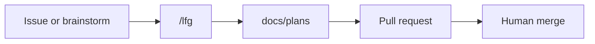

# AGENTS.md

Router for AI agents working in the Nexus repository. Read this first, then follow the linked rules for the task at hand. **Cursor rules win** on technical guardrails; **AGENTS.md LFG git policy** applies during `/lfg` and explicit autonomous runs.

## Project identity

Nexus is a lightweight, personal **lifting, sleep, nutrition, and habit tracker** — a **mobile-first PWA** where **offline resilience** is a core constraint. Treat changes that degrade offline behavior as regressions. Product scope and escalation boundaries live in [`STRATEGY.md`](STRATEGY.md). Repo layout and local setup: [`README.md`](README.md).

## LFG loop (default path)

Nexus uses **loop development**: `/lfg` runs plan → implement → review → push → PR → CI autofix autonomously. Planning happens inside LFG step 1 (`ce-plan` pipeline mode with headless doc review). The **only required human gate** is **PR review and merge**.

## When to use what

| Situation | Invoke |
|-----------|--------|
| Feature, bug, GitHub issue, brainstorm | `/lfg` with description, `issue #N`, or requirements path |
| Trivial one-file fix | `ce-work` |
| Plan only, no implementation yet | `ce-plan` (interactive) |
| Post-merge learnings | `ce-compound` |

Compound plugin skills (`lfg`, `ce-plan`, `ce-work`, `ce-code-review`, `ce-commit-push-pr`, `ce-compound`) ship with the Cursor Compound Engineering plugin. Do not reimplement the LFG pipeline — apply Nexus guardrails below.

## LFG guardrails

During `/lfg` or an explicit autonomous run:

- **No micro-approvals** — do not ask prefatory questions; maintain momentum until the plan is shipped or a hard stop applies.
- **Branch setup** — create a feature branch from `main` (pull first) per naming rules in [`.cursor/rules/03-agent-boundaries.mdc`](.cursor/rules/03-agent-boundaries.mdc). Never prompt "continue on this branch or create new?" — branch creation is automatic.
- **Commits** — atomic Conventional Commits per FSD layer (scope in parentheses, e.g. `feat(scope): description`).
- **Push and PR** — mandatory at ship; include `Closes #N` in the PR body when started from issue `#N`.
- **Supabase** — migrations only when the LFG-produced plan includes an explicit Schema/RLS implementation unit; run `npm run db:lint`; follow anon default-deny in [`.cursor/rules/03-agent-boundaries.mdc`](.cursor/rules/03-agent-boundaries.mdc).
- **Validation** — run the narrowest relevant check after each layer; full CI gate before PR: `npm run lint`, `npm run lint:ctx`, `npm run build`, and `npm run test:e2e:ci` when user interface or routing behavior changed.

**Hard stops** (pause and ask the human):

- Conflict with [`STRATEGY.md`](STRATEGY.md) "Not working on"
- Missing secrets or credentials (`.env` not configured)
- CI still red after 3 autofix iterations (record failures in PR body and exit)
- Scope change that alters foundational product logic

Detailed pre-flight and post-ship checklists: [`.cursor/rules/05-lfg-guardrails.mdc`](.cursor/rules/05-lfg-guardrails.mdc).

**Outside LFG:** conservative git — no commit unless the user explicitly requests it.

## Artifact paths

| Path | Purpose |
|------|---------|
| [`docs/brainstorms/`](docs/brainstorms/) | Requirements from `ce-brainstorm` |
| [`docs/plans/`](docs/plans/) | Implementation plans from `ce-plan` (audit trail LFG creates) |
| [`docs/solutions/`](docs/solutions/) | Post-mortem learnings from `ce-compound` |
| [`CONCEPTS.md`](CONCEPTS.md) | Shared domain vocabulary (entities, named processes, status concepts) |

Local compound config (optional): [`.compound-engineering/config.local.example.yaml`](.compound-engineering/config.local.example.yaml) → gitignored `config.local.yaml`.

Plan frontmatter extensions (Nexus): see [`docs/plans/README.md`](docs/plans/README.md).

## GitHub issues

Issues are **intake and tracking**; the plan file is the **execution audit trail**.

1. Create a GitHub issue (`gh issue create` or the repo Issues UI) with a clear title, requirements, and definition of done.
2. Run `/lfg implement issue #N` — agent reads issue via `gh`, writes plan with `issue: N`, creates branch, opens PR with `Closes #N`.
3. Human reviews and merges.
4. Optional: `ce-compound` → `docs/solutions/`.

Issue body informs planning; **do not execute from the issue body alone** — follow the plan file LFG produces.

## Rule router

| When you are… | Read |
|---------------|------|
| Starting any task | [`.cursor/rules/03-agent-boundaries.mdc`](.cursor/rules/03-agent-boundaries.mdc) |
| Running `/lfg` | [`.cursor/rules/05-lfg-guardrails.mdc`](.cursor/rules/05-lfg-guardrails.mdc) |
| Application code in `src/` | [`.cursor/rules/01-tech-stack.mdc`](.cursor/rules/01-tech-stack.mdc), [`.cursor/rules/02-fsd.mdc`](.cursor/rules/02-fsd.mdc) |
| UI in `src/` | [`.cursor/rules/04-frontend-implementation.mdc`](.cursor/rules/04-frontend-implementation.mdc) |

Do not duplicate stack, FSD, security, or UI standards here.

## CI and verification

PRs to `main` run [`.github/workflows/main-protection.yml`](.github/workflows/main-protection.yml): `npm ci`, `npm run lint`, `npm run lint:ctx`, `npm run build`, `npm run test:e2e:ci`.

## Post-merge compounding

After merge, optionally run `ce-compound` to write [`docs/solutions/`](docs/solutions/). Update [`.cursor/skills/`](.cursor/skills/) only when a **repeatable Nexus-specific pattern** emerged — not per-PR boilerplate.

## Policy hierarchy

1. [`STRATEGY.md`](STRATEGY.md) — product scope / escalation
2. Plan in `docs/plans/` — feature scope for the active LFG run
3. `.cursor/rules/*` — technical guardrails
4. This file — LFG workflow and git override during pipeline runs
