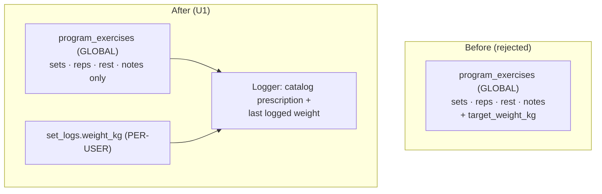

# U1 MVP Data Foundation — Requirements

## Summary

Ship the MVP **data foundation** (plan U1): new program catalog tables, user
training tables, `workout_sessions` extensions, RLS/grants per the adherence-loop
blueprint, extended `database.types.ts`, and **one seeded default program** —
a **Starting Strength–style** 3×/week template (A / B / A rotation). The catalog
stores only **shared** prescriptions (sets, reps, rest, notes); **working load
is never on the catalog** — it is derived per user from their last
`set_logs.weight_kg` when they log (U4/U7).

---

## Problem Frame

U1 unblocks the entire adherence loop (R1–R3). Without migrations + seed data,
downstream units cannot enroll users, serve today's session, log sets, or record
readiness.

Two product-model issues shaped this brief:

1. **Global catalog vs individual load.** `programs → program_days →
   program_exercises` are global and read-only (KTD-1). A `target_weight_kg`
   column on `program_exercises` is wrong for every user except by accident.
   Sets, reps, rest, and notes are the author's prescription and are shared;
   load is not.

2. **Default program must be real enough to train.** The plan defers PDF
   ingestion; U1 still needs one published program so onboarding and KTD-6
   rotation are exercisable on day one. Starting Strength (with barbell row on B
   instead of power clean) matches how the builder trains and is a well-known
   3×/week full-body template.

Progression automation stays Phase 2 — U1 does not store computed targets.

---

## Key Decisions

- **KD-1 — No load column on the catalog.** `program_exercises` has no
  `target_weight_kg` (or any shared weight field). KTD-1 unchanged.

- **KD-2 — Working load is derived from `set_logs`, not stored on the catalog.**
  The guided logger pre-fills from the user's most recent logged weight for that
  exercise; first exposure is empty. Phase 2 may add `user_exercise_targets`
  without migrating history.

- **KD-3 — Catalog prescription fields only:** `name`, `sort_order`,
  `target_sets`, `target_reps`, `rest_seconds`, `notes`.

- **KD-4 — Default seed = Starting Strength (MVP variant).** One `is_published`
  program, `days_per_week = 3`, **two** `program_days` (A, B). SS is a
  two-workout alternation, so KTD-6 rotation wraps `A → B → A → B …` and the
  `A B A` / `B A B` weekly flip-flop emerges from the 3×/week cadence — no third
  seeded day. Workout B uses **barbell row** instead of power clean (lower
  onboarding friction; still SS-adjacent).

- **KD-5 — SS-accurate set prescriptions where it matters.** Workout A deadlift
  is **1×5** (not 3×5). Other main lifts on A/B are **3×5**. Row on B is **3×5**.

- **KD-6 — Three incremental migrations + types.** Split per plan: catalog,
  user training + `workout_sessions` ALTER, seed. Mirror existing core RLS;
  `supabase db lint` before merge. No SQL in this doc — blueprint is the plan
  ERD + RLS posture (KTD-8).

### Load model (before → after)

---

## Requirements

### Schema and RLS (U1 migrations)

- R1. Create `programs`, `program_days`, `program_exercises` per plan ERD — **no
  weight column** on `program_exercises`.
- R2. Create `user_program_enrollments`, `readiness_checks`, `set_logs`; extend
  `workout_sessions` with `program_day_id`, `status`, `session_date` (nullable /
  defaulted for existing rows).
- R3. RLS: user-owned tables full CRUD for `authenticated` where
  `auth.uid() = user_id`; catalog tables **SELECT only** for `authenticated`,
  gated on `programs.is_published = true`; **REVOKE `anon`** on all new tables.
- R4. Constraints: unique `(user_id, check_date)` on `readiness_checks`; at most
  one `is_active` enrollment per user; `user_id` indexes on user-owned tables.
- R5. Extend `src/shared/api/database.types.ts` with all new tables and altered
  `workout_sessions` columns so U2–U4 compile.

### Seeded default program (Starting Strength MVP)

- R6. Exactly one published program (`is_published = true`) after seed migration.
- R7. Program metadata: human-readable name (e.g. "Starting Strength"), stable
  slug (e.g. `starting-strength-mvp`), `days_per_week = 3`, short description.
- R8. **Two** `program_days`, `sort_order` 1–2, `day_index` 1–2:
  - **Day 1 — Workout A**
  - **Day 2 — Workout B**

  Starting Strength is a two-workout alternation trained 3×/week, **not** three
  fixed days. Seeding two days lets KTD-6 rotation wrap as `A → B → A → B …`,
  which across a 3-session week produces the correct `A B A` / `B A B` flip-flop
  with no week-parity logic. The `3` lives only in `days_per_week` (the weekly
  consistency target, KTD-3) and is decoupled from the **two** workout templates.
- R9. Exercises per day (names are catalog text; order via `sort_order`):

  | Day | Exercise | `target_sets` | `target_reps` |
  |-----|----------|---------------|---------------|
  | A | Squat | 3 | 5 |
  | A | Bench Press | 3 | 5 |
  | A | Deadlift | 1 | 5 |
  | B | Squat | 3 | 5 |
  | B | Overhead Press | 3 | 5 |
  | B | Barbell Row | 3 | 5 |

- R10. Each `program_exercise` has sensible `rest_seconds` for compounds (e.g.
  180s); `notes` nullable. No weight fields.

### Individualized load (product rule; enforced in U4/U7)

- R11. Working weight at log time = user's most recent `set_logs.weight_kg` for
  that exercise; empty if never logged.
- R12. Load exists only on user `set_logs` rows; never on catalog rows.
- R13. `weight_kg` nullable supports bodyweight / no added load.

### Forward compatibility

- R14. Phase 2 progression / `user_exercise_targets` can supersede derivation
  without migrating `set_logs`.

---

## Acceptance Examples

- AE1. **R6, R8, R9.** After migrations, `authenticated` SELECT returns one
  published program with `days_per_week = 3` and exactly **two** `program_days`:
  Day 1 (A) has Squat/Bench/Deadlift (deadlift 1×5); Day 2 (B) has Squat/OHP/Row
  (each 3×5).
- AE7. **R8, KTD-6.** Rotating from a completed Day B serves Day A next (wrap),
  and from Day A serves Day B — so consecutive 3×/week calendars alternate
  `A B A` then `B A B` without any seeded "Day 3".
- AE2. **R3.** User B's JWT returns zero rows for User A's `set_logs` and
  `readiness_checks`.
- AE3. **R3.** `anon` cannot SELECT any new table.
- AE4. **R11, R12.** Two users on the same seeded Squat see identical 3×5 from
  catalog; each sees their own last logged weight (or empty) — never the other's.
- AE5. **R4.** Second readiness row for same `(user_id, check_date)` is rejected.
- AE6. **R2, R4.** Only one `is_active` enrollment per user.

---

## Scope Boundaries

### Deferred for later

- PDF program ingestion into the catalog (plan follow-up).
- `user_exercise_targets`, linear progression automation (Phase 2).
- Percentage-of-1RM or template starting loads in the catalog.
- Match-key precedence and per-set vs per-exercise pre-fill (U4/U7).
- Generic offline write queue beyond workout buffer (KTD-5).

### Outside U1

- Entity/query layers (U2–U4), UI (U7–U9), scoring (U5), nudges (U6), E2E (U10).
- Readiness-adjusted consistency formula (KTD-3) — tables only here.

---

## Dependencies / Assumptions

- Shipped: auth, `profiles`, `workout_sessions`, `health_metrics`, core RLS
  migrations under `supabase/migrations/`.
- Blueprint authority: `docs/plans/2026-06-02-001-feat-mvp-adherence-loop-plan.md`
  ERD + RLS (aligned with this doc).
- Local Supabase available for `db lint` and migration apply during `ce-work`.
- Builder is the primary user; SS + row-on-B matches actual training intent.

---

## Outstanding Questions

### Deferred to U4 (logger)

- **Match key** for last weight: prefer `program_exercise_id`, fall back to
  `exercise_name` (KTD-7).
- **Per-set vs per-exercise** pre-fill behavior.

### Deferred to U1 implementation (`ce-work`)

- Exact `rest_seconds` and optional `notes` copy per exercise (defaults OK).
- Seed migration idempotency strategy (delete-and-reseed vs upsert by slug) —
  planning detail, not product behavior.
