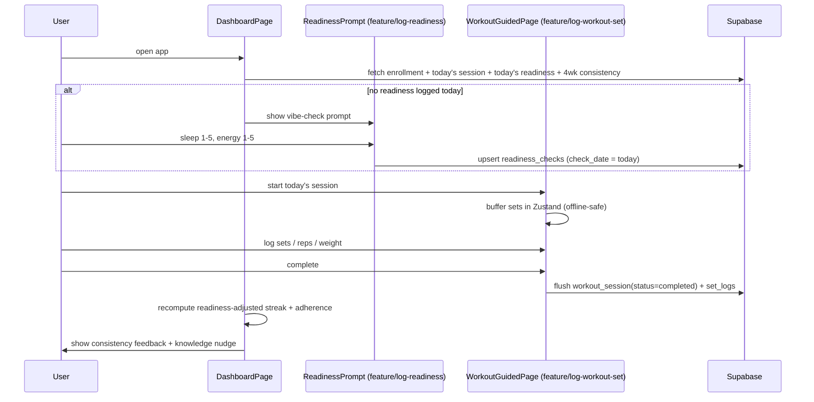

# feat: Nexus MVP — The Adherence Loop + Knowledge

**Date:** 2026-06-02
**Type:** feat
**Status:** active
**Depth:** Deep
**Origin:** `docs/brainstorms/2026-06-02-nexus-roadmap-requirements.md` (Phase 1 / MVP floor)
**Branch:** `plan/initialstrategy`

---

## Summary

Implement the Nexus MVP "Adherence Loop": load a preset program, serve up
today's session, log a workout with a fast offline-first guided UI, capture a
daily readiness vibe-check, and surface **readiness-adjusted consistency**
feedback plus a static knowledge nudge. This is the smallest version that proves
the core bet — that a workout app treating the user as a whole system keeps them
consistent — and the one the user opens daily.

Auth + RLS (Feature 1.1) is already shipped. This plan adds the program/workout/
readiness data model (designed here as the blueprint), the FSD entity/feature/
widget slices, and the dashboard + guided-workout assembly.

---

## Problem Frame

Per origin §2: the validated problem is **consistency**, driven by two failure
modes — no feedback loop, and life/recovery derailment. The resolution is a
feedback loop scored as **readiness-adjusted adherence**: showing up *and*
training appropriately for your state is the win condition; a smart rest on a
low-readiness day counts as success, not a broken streak (origin §1, §8.3).

**In scope (MVP floor, origin §5):** preset program → today's session, guided
offline logging, manual readiness vibe-check, readiness-adjusted consistency
feedback, static knowledge nudges.

**Explicitly out (origin §6–§7):** health-OS telemetry, HRV/sleep auto-import,
WRS calculator, LLM notes, progression automation, smart substitution,
gamification visualization, social, AI programming.

---

## Requirements Traceability

| Req | Origin | Advanced by |
|-----|--------|-------------|
| R1 — Preset program, "today's session" served up | MVP-1 | U1, U2, U7, U8, U9 |
| R2 — Guided, offline-first workout execution + logging | MVP-2 | U1, U4, U7, U8, U9, U10 |
| R3 — Manual readiness vibe-check (sleep + energy, 1–5) | MVP-3 | U1, U3, U7, U8 |
| R4 — Readiness-adjusted consistency feedback | MVP-4 | U3, U5, U8 |
| R5 — Static knowledge nudges (no LLM) | MVP-5 | U6, U8 |
| R6 — Consistency north-star measurable (≥80%/4wk) | §4 | U5 |
| R7 — Offline resilience preserved (core constraint) | §9 | U4, U10 |

---

## Key Technical Decisions

**KTD-1 — Programs are a global, read-only catalog (not per-user copies).**
`programs → program_days → program_exercises` carry no `user_id`; they are
seeded via migration and readable by all authenticated users. Rationale:
supports a future preset library ingested from the user's PDF programs (origin
§3, OQ-1) without duplicating rows per user, and keeps program definitions
immutable from the client. User participation is modeled by
`user_program_enrollments`.

**KTD-2 — `readiness_checks` is a dedicated table, separate from
`health_metrics`.** Readiness is a subjective daily check (sleep quality +
energy, 1–5) with a one-row-per-day constraint feeding the consistency score;
`health_metrics` holds objective measurements. Keeping them separate avoids
overloading semantics and lets readiness evolve toward Phase 3 auto-import
cleanly. Relationship noted for future reconciliation.

**KTD-3 — Readiness-adjusted consistency formula (v1, tunable).** Resolves
OQ-3. Constants live in one module (`entities/consistency`) so they are tunable
without touching call sites.
- `readiness_score = sleep_quality + energy` → range 2–10.
- A day is **low-readiness** when `readiness_score ≤ LOW_THRESHOLD` (v1 = 4).
- Per ISO week, against the program's `days_per_week` (= weekly target):
  - `completed` = distinct days with a completed `workout_session`.
  - `smartRestCredits` = low-readiness days with no completed session, capped at
    `floor(target / 2)` (so a user cannot rest their way to a perfect week).
  - `weeklyAdherence = min(completed + smartRestCredits, target) / target`.
- **4-week adherence** = `Σ min(completed+credits, target) / Σ target` over the
  trailing 4 ISO weeks → the north-star (R6); target ≥ 0.80.
- **Streak** (motivation surface) = consecutive ISO weeks where
  `completed + smartRestCredits ≥ target`.

**KTD-4 — Knowledge nudges ship as static in-app content (no DB).** Resolves
OQ-4. A typed catalog in `entities/knowledge` with contextual tags
(`post-workout`, `low-readiness`, `general`). Offline-friendly, zero backend,
trivially editable. PDF/LLM-sourced nudges are deferred.

**KTD-5 — Offline workout buffer via Zustand (persisted), not a generic
mutation queue.** The in-progress session + set logs live in a persisted Zustand
store so mid-workout logging works fully offline; on completion (or reconnect)
the buffer flushes to Supabase via a React Query mutation. Reads use the
existing React Query persisted cache (`src/app/query-persist.ts`). A full
generic offline write queue is deferred (R7, origin §9).

**KTD-6 — "Today's session" = next program day in rotation.** With no completed
session yet, serve the enrollment's first `program_day`; otherwise the day after
the last completed `program_day` (wrapping). Fixed weekday scheduling is
deferred to Phase 2 (origin §6).

**KTD-7 — Exercises are denormalized text on `program_exercises` and
`set_logs`.** No relational exercise library yet (origin §6, Epic 7.1 → Phase 4).
`set_logs.exercise_name` is denormalized so logged history survives catalog
edits.

**KTD-8 — Schema is designed in this plan as the blueprint; migrations are
written during `ce-work`.** Per `AGENTS.md` Blueprint phase, this plan's ERD +
table specs + RLS posture constitute the approved blueprint. No SQL is written
until U1 executes post-approval, following `.cursor/skills/architect-planning`
(ERD already provided below) and anon default-deny from
`.cursor/rules/03-agent-boundaries.mdc`.

---

## High-Level Technical Design

### Data model (ERD)

Existing: `auth.users`, `public.profiles`, `public.workout_sessions`,
`public.health_metrics`. New tables and the `workout_sessions` extension shown
below.

```mermaid
erDiagram
  auth_users["auth.users"] ||--|| profiles : "id"
  auth_users ||--o{ workout_sessions : "user_id"
  auth_users ||--o{ readiness_checks : "user_id"
  auth_users ||--o{ user_program_enrollments : "user_id"
  auth_users ||--o{ set_logs : "user_id"

  programs ||--o{ program_days : "program_id"
  program_days ||--o{ program_exercises : "program_day_id"
  programs ||--o{ user_program_enrollments : "program_id"
  program_days ||--o{ workout_sessions : "program_day_id (nullable)"
  workout_sessions ||--o{ set_logs : "workout_session_id"
  program_exercises ||--o{ set_logs : "program_exercise_id (nullable)"

  programs {
    uuid id PK
    text slug UK
    text name
    text description
    smallint days_per_week
    boolean is_published
    timestamptz created_at
  }
  program_days {
    uuid id PK
    uuid program_id FK
    smallint day_index
    text name
    smallint sort_order
  }
  program_exercises {
    uuid id PK
    uuid program_day_id FK
    text name
    smallint sort_order
    smallint target_sets
    text target_reps
    numeric target_weight_kg "nullable"
    smallint rest_seconds "nullable"
    text notes "nullable"
  }
  user_program_enrollments {
    uuid id PK
    uuid user_id FK
    uuid program_id FK
    boolean is_active
    timestamptz started_at
    timestamptz created_at
  }
  readiness_checks {
    uuid id PK
    uuid user_id FK
    date check_date
    smallint sleep_quality "1-5"
    smallint energy "1-5"
    smallint readiness_score "derived 2-10"
    text note "nullable"
    timestamptz created_at
  }
  workout_sessions {
    uuid id PK
    uuid user_id FK
    uuid program_day_id FK "nullable (new)"
    text status "new: in_progress|completed|skipped"
    date session_date "new"
    timestamptz started_at
    timestamptz ended_at
    text notes
  }
  set_logs {
    uuid id PK
    uuid user_id FK
    uuid workout_session_id FK
    uuid program_exercise_id FK "nullable"
    text exercise_name
    smallint set_index
    text target_reps "nullable"
    numeric weight_kg "nullable"
    smallint reps "nullable"
    boolean is_completed
    timestamptz created_at
  }
```

**RLS posture (KTD-8):**
- **User-owned** (`workout_sessions`, `set_logs`, `readiness_checks`,
  `user_program_enrollments`): enable RLS; SELECT/INSERT/UPDATE/DELETE policies
  `to authenticated using/with check ((select auth.uid()) = user_id)`. GRANT the
  four verbs to `authenticated`. Follow the existing migration pattern.
- **Global catalog** (`programs`, `program_days`, `program_exercises`): enable
  RLS; SELECT-only policy `to authenticated using (true)` (programs gated on
  `is_published = true`). GRANT **SELECT only** to `authenticated` (seed/edit via
  migration/service role). **REVOKE all from `anon`** on every new table per
  anon default-deny.
- Add `user_id` index on every user-owned table; unique
  `(user_id, check_date)` on `readiness_checks`; unique partial index enforcing
  one `is_active` enrollment per user.

### Core loop (sequence)



---

## Output Structure

New FSD slices (additions to existing `src/`):

```text
src/
├── entities/
│   ├── program/            # U2  catalog types + queries
│   ├── readiness/          # U3  readiness types + queries + score derivation
│   ├── workout/            # U4  session/set types + queries + offline buffer
│   ├── consistency/        # U5  readiness-adjusted scoring (pure functions)
│   └── knowledge/          # U6  static nudge catalog + selection
├── features/
│   ├── select-program/     # U7  enroll in the default program
│   ├── log-readiness/      # U7  vibe-check form
│   └── log-workout-set/    # U7  set-logging controls
├── widgets/                # U8  new FSD layer
│   ├── today-session/
│   ├── readiness-prompt/
│   ├── consistency-summary/
│   └── knowledge-nudge/
└── pages/
    ├── onboarding-page/      # U9
    └── workout-guided-page/  # U9
supabase/migrations/          # U1  (created during ce-work, post-approval)
```

Per-unit `**Files:**` are authoritative; the implementer may refine layout.

---

## Implementation Units

Grouped into three phases. Units are dependency-ordered; U-IDs are stable.

### Phase A — Data foundation

### U1. Schema migrations, seed program, and generated types

**Goal:** Create the MVP data model and seed one default program.
**Requirements:** R1, R2, R3.
**Dependencies:** none (executes after plan approval per KTD-8).
**Files:**
- `supabase/migrations/<ts>_mvp_programs_catalog.sql` (programs, program_days, program_exercises + RLS + SELECT grants + REVOKE anon)
- `supabase/migrations/<ts>_mvp_user_training.sql` (user_program_enrollments, readiness_checks, set_logs + RLS; ALTER workout_sessions add program_day_id, status, session_date)
- `supabase/migrations/<ts>_mvp_seed_default_program.sql` (insert one published program with days + exercises)
- `src/shared/api/database.types.ts` (extend `Database` with all new tables)
**Approach:** Mirror the RLS/grant/index pattern in
`supabase/migrations/20260509191000_core_profiles_workout_health_rls.sql` exactly
(policies `to authenticated`, `(select auth.uid()) = user_id`, per-table
`user_id` index). Apply KTD-8 RLS posture: catalog tables get SELECT-only +
REVOKE anon; user tables get full CRUD policies. Add the unique constraints from
the HTD. Keep migrations incremental (never edit prior migrations).
**Execution note:** Run `supabase db lint` after writing; re-run advisors per
`.cursor/skills/architect-planning/SKILL.md`. Verify anon cannot SELECT any new
table.
**Patterns to follow:** existing core RLS migration; `revoke_anon_select` migration.
**Test scenarios:**
- Covers R1. Seed migration produces exactly one `is_published` program with
  ≥1 `program_day` and ≥1 `program_exercise` per day.
- RLS: a second user's JWT returns 0 rows for User A's `workout_sessions`,
  `set_logs`, `readiness_checks`, `user_program_enrollments`.
- Catalog: `authenticated` can SELECT `programs/program_days/program_exercises`
  but INSERT/UPDATE/DELETE are denied.
- `anon` role SELECT on every new table returns permission denied / 0 rows.
- `readiness_checks` rejects a second row for the same `(user_id, check_date)`.
- Only one `is_active` enrollment per user can exist.
**Verification:** `supabase db lint` clean; migrations apply on a fresh local DB;
cross-user and anon access proven denied; types compile against new tables.

### U2. `entities/program` — catalog types and queries

**Goal:** Read access to the program catalog and the user's active enrollment.
**Requirements:** R1.
**Dependencies:** U1.
**Files:** `src/entities/program/model/types.ts`,
`src/entities/program/api/program-queries.ts`,
`src/entities/program/api/enrollment-queries.ts`,
`src/entities/program/api/program-queries.test.ts`, `src/entities/program/index.ts`
**Approach:** Types for `Program`, `ProgramDay`, `ProgramExercise`,
`Enrollment`. Query fns: `getPublishedPrograms`, `getProgramWithDays(programId)`,
`getActiveEnrollment(userId)`, `enrollInProgram(userId, programId)` (deactivates
prior active). Use the shared Supabase client; expose React Query keys. Mirror
`src/entities/user/api/profile-queries.ts` shape.
**Patterns to follow:** `src/entities/user/` (types + queries + barrel + store).
**Test scenarios:**
- `getProgramWithDays` returns days sorted by `sort_order` with nested exercises.
- `enrollInProgram` deactivates any prior active enrollment (only one active).
- Query keys are stable/serializable for React Query persistence.
**Verification:** unit tests pass; barrel exposes only the public API; no
cross-slice imports.

### U3. `entities/readiness` — readiness types, queries, score derivation

**Goal:** Persist and read the daily vibe-check; derive `readiness_score`.
**Requirements:** R3, R4.
**Dependencies:** U1.
**Files:** `src/entities/readiness/model/types.ts`,
`src/entities/readiness/model/derive-score.ts`,
`src/entities/readiness/model/derive-score.test.ts`,
`src/entities/readiness/api/readiness-queries.ts`,
`src/entities/readiness/api/readiness-queries.test.ts`,
`src/entities/readiness/index.ts`
**Approach:** `deriveReadinessScore({sleepQuality, energy})` → `sleep + energy`
(KTD-3). Queries: `getReadinessForDate(userId, date)`,
`upsertReadiness(userId, date, {sleepQuality, energy, note})` (writes derived
score). One row per `(user_id, check_date)`.
**Test scenarios:**
- `deriveReadinessScore` maps {sleep:1,energy:1}→2 and {5,5}→10; rejects
  out-of-range inputs (1–5 guard).
- `upsertReadiness` updates the same-day row rather than inserting a duplicate.
- `getReadinessForDate` returns null when none logged.
**Verification:** unit tests pass; same-day upsert idempotent.

### U4. `entities/workout` — session/set types, queries, offline buffer

**Goal:** Create/complete sessions, log sets, and buffer in-progress work offline.
**Requirements:** R2, R7.
**Dependencies:** U1.
**Files:** `src/entities/workout/model/types.ts`,
`src/entities/workout/model/active-session-store.ts` (Zustand, persisted),
`src/entities/workout/model/active-session-store.test.ts`,
`src/entities/workout/api/workout-queries.ts`,
`src/entities/workout/api/workout-queries.test.ts`, `src/entities/workout/index.ts`
**Approach:** Per KTD-5, `useActiveSessionStore` holds the in-progress session
(program_day_id, buffered set logs) and persists to storage so a reload/offline
mid-workout survives. `completeSession()` flushes session
(`status='completed'`) + `set_logs` to Supabase via a mutation, then clears the
buffer. Reads (`getRecentSessions`, `getSessionsInRange`) use React Query.
Mirror the persistence pattern in `src/app/query-persist.ts` and the Zustand
store in `src/entities/user/model/store.ts`.
**Execution note:** Add a failing test for buffer→flush→clear before wiring the
mutation.
**Test scenarios:**
- Adding/editing a buffered set updates store state without a network call.
- Buffer survives a simulated reload (persistence round-trip).
- `completeSession` flush builds the correct `workout_session` + `set_logs`
  payload (status completed, denormalized `exercise_name`, `user_id` set).
- Flush failure leaves the buffer intact for retry (no data loss).
- `getSessionsInRange` returns sessions for the trailing window used by U5.
**Verification:** unit tests pass; mid-workout state is offline-safe; failed
flush is recoverable.

### U5. `entities/consistency` — readiness-adjusted scoring

**Goal:** Compute streak + 4-week adherence from sessions + readiness (KTD-3).
**Requirements:** R4, R6.
**Dependencies:** U3, U4.
**Files:** `src/entities/consistency/model/scoring.ts`,
`src/entities/consistency/model/scoring.test.ts`,
`src/entities/consistency/model/constants.ts`,
`src/entities/consistency/index.ts`
**Approach:** Pure functions over `{ completedSessions[], readinessChecks[],
weeklyTarget }`. Implement `classifyWeek`, `weeklyAdherence`,
`fourWeekAdherence`, `currentStreak` exactly per KTD-3, with `LOW_THRESHOLD` and
the `floor(target/2)` smart-rest cap in `constants.ts`. No I/O — caller passes
data fetched via U3/U4.
**Execution note:** Implement test-first; this is the signature mechanic and
must be exhaustively covered.
**Test scenarios:**
- A completed session day counts toward weekly adherence.
- A low-readiness day (score ≤4) with no session counts as a smart-rest credit.
- Smart-rest credits are capped at `floor(target/2)` (a fully-rested week does
  NOT reach 100%).
- A normal-readiness day with no session yields no credit (adherence drops).
- 4-week adherence aggregates `Σ wins / Σ target` correctly across ISO weeks,
  including a partial trailing week.
- Streak counts consecutive target-met weeks and resets on a missed week.
- Boundary: `weeklyTarget = 1` → cap `floor(1/2)=0` (no rest-only credit).
- Empty data → adherence 0, streak 0 (no throw).
**Verification:** unit tests pass; ≥80%/4-week north-star (R6) is computable and
matches hand-worked fixtures.

### U6. `entities/knowledge` — static nudge catalog + selection

**Goal:** Ship curated knowledge nudges and pick a contextually relevant one.
**Requirements:** R5.
**Dependencies:** none.
**Files:** `src/entities/knowledge/model/types.ts`,
`src/entities/knowledge/model/nudges.ts` (static catalog),
`src/entities/knowledge/model/select-nudge.ts`,
`src/entities/knowledge/model/select-nudge.test.ts`,
`src/entities/knowledge/index.ts`
**Approach:** `Nudge = { id, title, body, tags }` with tags
`'post-workout' | 'low-readiness' | 'general'`. `selectNudge(context)` returns a
relevant nudge (e.g., low-readiness context → recovery/why-rest-matters nudge),
deterministic given a date seed so it's stable across a session. No DB (KTD-4).
**Test scenarios:**
- `selectNudge('low-readiness')` returns a nudge tagged for low readiness.
- `selectNudge('post-workout')` returns a post-workout nudge.
- Selection is stable for the same day seed; rotates across days.
- Catalog ships ≥6 nudges spanning all three contexts.
**Verification:** unit tests pass; nudges render as plain text (offline).

### Phase B — Interaction

### U7. Features — select-program, log-readiness, log-workout-set

**Goal:** User scenarios composing the entities into actions.
**Requirements:** R1, R2, R3.
**Dependencies:** U2, U3, U4.
**Files:**
- `src/features/select-program/ui/StartProgramButton.tsx`, `.../index.ts`
- `src/features/log-readiness/ui/ReadinessForm.tsx`, `.../index.ts`
- `src/features/log-workout-set/ui/SetLogRow.tsx`,
  `src/features/log-workout-set/ui/ExerciseLogList.tsx`, `.../index.ts`
- co-located `*.test.tsx` for each form/control
**Approach:** Features import only from entities/shared (FSD; no cross-feature
imports). `ReadinessForm` uses `react-hook-form` + `zod` (existing deps) with two
1–5 controls + optional note → `upsertReadiness`. `log-workout-set` controls
write to the U4 Zustand buffer (offline-safe). `select-program` calls
`enrollInProgram`. Deliver loading/empty/error/success states per
`.cursor/rules/04-frontend-implementation.mdc`.
**Patterns to follow:** `src/features/auth-by-email/ui/EmailAuthForm.tsx` (RHF +
zod + shared UI), shared UI kit in `src/shared/ui/`.
**Test scenarios:**
- `ReadinessForm` validates 1–5 range, blocks submit on invalid, submits derived
  payload.
- `SetLogRow` edits weight/reps and marks a set complete in the buffer without a
  network call (offline).
- `StartProgramButton` triggers enrollment and reflects pending/disabled state.
- Each form renders error state on a rejected mutation.
**Verification:** component tests pass; lint clean; no FSD boundary violations.

### U8. Widgets — today-session, readiness-prompt, consistency-summary, knowledge-nudge

**Goal:** Composite dashboard blocks combining features + entities.
**Requirements:** R1, R2, R3, R4, R5.
**Dependencies:** U5, U6, U7.
**Files:**
- `src/widgets/today-session/ui/TodaySessionCard.tsx`, `.../index.ts`
- `src/widgets/readiness-prompt/ui/ReadinessPrompt.tsx`, `.../index.ts`
- `src/widgets/consistency-summary/ui/ConsistencySummary.tsx`, `.../index.ts`
- `src/widgets/knowledge-nudge/ui/KnowledgeNudgeCard.tsx`, `.../index.ts`
- co-located `*.test.tsx`
**Approach:** New `widgets` FSD layer (per `.cursor/rules/02-fsd.mdc` layer 3).
`TodaySessionCard` resolves today's session via KTD-6 and links to the guided
page. `ReadinessPrompt` shows the vibe-check when none is logged today, else a
compact summary. `ConsistencySummary` renders streak + 4-week adherence (R6)
from U5, framing smart-rest days positively. `KnowledgeNudgeCard` renders the
selected nudge. Widgets import features/entities/shared only — never pages.
**Test scenarios:**
- `TodaySessionCard` shows the correct next program day given last-completed
  state (KTD-6), and a start CTA.
- `ReadinessPrompt` shows the form when unlogged, summary when logged today.
- `ConsistencySummary` displays a smart-rest day as a win, not a break.
- `KnowledgeNudgeCard` renders the contextual nudge body.
- Each widget renders loading + empty states.
**Verification:** component tests pass; FSD boundaries clean.

### Phase C — Assembly + verification

### U9. Pages and routing — onboarding, guided workout, dashboard composition

**Goal:** Wire the loop into routes with an enrollment gate.
**Requirements:** R1, R2.
**Dependencies:** U8.
**Files:**
- `src/pages/onboarding-page/OnboardingPage.tsx`, `.../index.ts`
- `src/pages/workout-guided-page/WorkoutGuidedPage.tsx`, `.../index.ts`
- `src/pages/dashboard-page/DashboardPage.tsx` (compose widgets)
- `src/pages/index.ts` (export new pages)
- `src/app/App.tsx` (add `/onboarding`, `/workout` routes)
- `src/app/RequireActiveProgram.tsx` (gate: redirect to `/onboarding` if no active enrollment)
**Approach:** `OnboardingPage` confirms/starts the default program
(`select-program`). `RequireActiveProgram` wraps the dashboard + workout routes,
nested inside the existing `RequireProfileDisplayName`. `DashboardPage` composes
the four widgets (mobile-first, `max-w-md`). `WorkoutGuidedPage` renders the
step-through logging UI from `log-workout-set` over the active session buffer.
Pages compose widgets/features only.
**Patterns to follow:** `src/app/RequireProfileDisplayName.tsx` (gate pattern),
existing `App.tsx` nested-route structure, `DashboardPage.tsx`.
**Test scenarios:**
- An authenticated user with no active enrollment is redirected to `/onboarding`.
- After enrolling, the dashboard renders all four widgets.
- `/workout` shows today's session and persists buffered sets across a reload.
- Completing a workout returns to the dashboard with updated consistency.
**Verification:** routes resolve; gate redirects correctly; lint + build clean.

### U10. Offline resilience + Cypress E2E for the core loop

**Goal:** Prove the daily loop end-to-end and that core flows survive offline.
**Requirements:** R2, R7.
**Dependencies:** U9.
**Files:** `cypress/e2e/adherence-loop.cy.ts` (+ fixtures/helpers as needed)
**Approach:** Follow `.cursor/skills/cypress-tester/SKILL.md`. E2E: log in → land
on onboarding → start program → log readiness → start today's session → log sets
→ complete → see consistency update + nudge. Add an offline assertion: with the
network stubbed offline mid-workout, buffered sets persist and flush on
reconnect (KTD-5/R7).
**Execution note:** Start the local dev server and run in the self-healing loop
per the tester skill.
**Test scenarios:**
- Happy path: full loop completes and consistency reflects the session.
- Offline mid-workout: buffered sets survive a reload while offline; flush on
  reconnect with no data loss.
- A low-readiness day with no workout shows as a smart-rest win in the summary.
**Verification:** `npm run test:e2e:ci` passes; `npm run lint`, `npm run lint:ctx`,
`npm run build` clean (matches CI in `.github/workflows/main-protection.yml`).

---

## Scope Boundaries

### Deferred for later (in the vision — origin §6)
- Linear progression automation; manual sleep/nutrition logging; deeper flexible
  (weekday) scheduling (Phase 2).
- Health-OS integrations, WRS calculator, LLM science notes (Phase 3).
- Gamification depth / bio-core visualization; relational exercise library +
  smart substitution (Phase 4).

### Outside this product's identity (Icebox — origin §7)
- AI-generated custom programming; social profiles & communities; real-time
  feeds; "smart gym" equipment-profile auto-adjustment.

### Deferred to follow-up work (plan-local)
- **PDF program ingestion** → a richer preset library. The global catalog
  (KTD-1) is ready to receive these rows; ingestion is a separate seed/import
  task once the PDFs are provided (`docs/reference/programs/` or attached).
- Generic offline write queue beyond the workout buffer (KTD-5).
- `readiness_checks` ↔ `health_metrics` reconciliation (KTD-2).
- `database.types.ts` codegen via Supabase CLI (currently hand-maintained).

---

## Risks & Dependencies

| Risk | Impact | Mitigation |
|------|--------|-----------|
| Schema blueprint not approved before migrations | Blocks U1; violates `AGENTS.md` | This plan IS the blueprint (KTD-8); confirm approval before U1 |
| Offline buffer data loss on flush failure | User loses a workout | Keep buffer until flush confirmed; retry on reconnect (U4) |
| Scoring formula feels punitive/lax in practice | Undermines the core bet | Constants isolated + tunable (KTD-3); validate against R6 fixtures |
| `workout_sessions` ALTER vs existing rows | Migration friction | New columns nullable / defaulted; incremental migration (U1) |
| Scope creep into Phase 2 (scheduling/progression) | Misses "ship fast" | Deferred boundaries above; KTD-6 keeps "today" simple |

**Dependencies:** shipped auth + RLS (Feature 1.1); existing React Query
persistence (`src/app/query-persist.ts`); local Supabase for migrations/tests.

---

## System-Wide Impact

- **New FSD `widgets` layer** introduced (allowed by `.cursor/rules/02-fsd.mdc`);
  ESLint boundaries config may need the widgets layer registered.
- **`workout_sessions` gains columns** consumed by future phases — keep additive.
- **Offline contract:** the workout buffer sets the pattern future write-heavy
  features should follow; document it as the reference approach.

---

## Open Questions (deferred to implementation)

- Exact default-program contents (exercise selection/sets/reps) — pick a simple,
  well-known full-body 3×/week template at U1 seed time; tunable later.
- Initial knowledge-nudge copy (U6) — draft ≥6 short, sourced nudges; wording is
  editable post-MVP.
- ESLint `eslint-plugin-boundaries` config changes needed to register `widgets`
  — confirm at U8.

---

## Next Steps

1. Approve this plan as the Supabase blueprint (KTD-8) so U1 migrations may be
   written.
2. Run `/ce-work` against this plan, executing Phase A → B → C in U-ID order.
3. Translate units into GitHub Issues per the GNAP pipeline
   (`docs/handoffs/260507nexus-factory-floor-handoff.md`) if tracking there.
