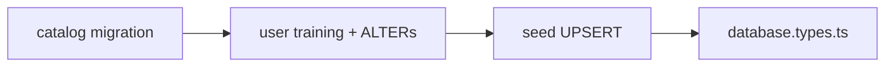
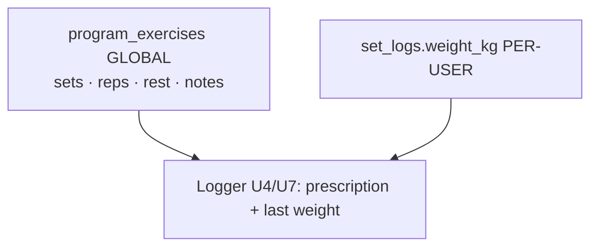

# feat: U1 MVP data foundation

## Summary

Ship the MVP **data foundation** in four landable units (M1–M4): program catalog DDL + RLS,
user-training DDL + `workout_sessions` / `profiles` ALTERs, idempotent Starting
Strength seed, and hand-maintained `database.types.ts`. Working load stays off the
catalog; the seed never deletes catalog rows. Confirmed scoping: child catalog RLS
joins through `is_published`, legacy sessions backfill to `completed` when
`ended_at` is set, and types cover all tables U2–U4 will query (including pre-U1
core tables).

---

## Problem Frame

U1 unblocks the adherence loop (see origin). Without migrations and seed data,
downstream units cannot enroll users, resolve today's session, log sets, or store
readiness.

Two model constraints drive the schema (see origin):

1. **Global catalog vs individual load** — `program_exercises` hold shared
   prescriptions only; weight lives on `set_logs` per user.
2. **Real default program** — one published Starting Strength A/B template
   (`days_per_week = 3`, two rotating days) so onboarding and rotation are
   exercisable before PDF ingestion.

Entity layers, UI, blueprint KTD-6 rotation logic, and logger pre-fill are **out of scope**
(parent plan U2–U10).

---

## Requirements

### Schema and RLS

- R1. Create `programs`, `program_days`, `program_exercises` per blueprint ERD —
  **no weight column** on `program_exercises` (see origin KD-1).
- R2. Create `user_program_enrollments`, `readiness_checks`, `set_logs`; extend
  `workout_sessions` with `program_day_id`, `status`, `session_date`; extend
  `profiles` with `timezone` (see origin R2, R18).
- R3. RLS: user-owned tables full CRUD for `authenticated` where
  `auth.uid() = user_id`; catalog **SELECT only** for `authenticated`, with
  **all three catalog tables** gated so rows are visible only when the parent
  program has `is_published = true`; **REVOKE from `anon`** on every new table
  (see origin R3, `.cursor/rules/03-agent-boundaries.mdc`).
- R4. Constraints: unique `(user_id, check_date)` on `readiness_checks`;
  partial unique one `is_active` enrollment per user; `user_id` indexes on
  user-owned tables; `CHECK` on `readiness` (1–5) and `workout_sessions.status`
  (`in_progress`, `completed`, `skipped`) (see origin R4).
- R5. Extend `src/shared/api/database.types.ts` for all new and altered tables
  **and** existing `workout_sessions` / `health_metrics` so U2–U4 compile
  (see origin R5).

### Seeded default program

- R6. Exactly one published program after seed (see origin R6).
- R7. Metadata: human-readable name, stable slug `starting-strength-mvp`,
  `days_per_week = 3`, short description (see origin R7).
- R8. Two `program_days` only: `workout-a`, `workout-b` (see origin R8).
- R9. Exercises per origin table (deadlift **1×5** on A; row on B; slugs per
  origin R9) (see origin R9).
- R10. `rest_seconds` (e.g. 180), nullable `notes`; no weight fields (see
  origin R10).

### Individualized load (product rule; U4/U7 enforce)

- R11. Working weight at log time = last `set_logs.weight_kg` for that exercise;
  empty if never logged (see origin R11).
- R12. Load only on `set_logs`; never on catalog (see origin R12).
- R13. `weight_kg` nullable (see origin R13).

### Data integrity and timezones

- R14. Phase 2 targets can supersede derivation without migrating `set_logs`
  (see origin R14).
- R15. Seed uses idempotent UPSERT; **never `DELETE`** catalog rows (see origin
  R15, KD-7).
- R16. Stable `slug` UKs: `programs.slug`, `program_days (program_id, slug)`,
  `program_exercises (program_day_id, slug)` (see origin R16).
- R17. `check_date` / `session_date` are `date` with **no** server
  `current_date` / UTC default — client supplies local day (see origin R17).
- R18. `profiles.timezone text not null default 'UTC'` (IANA) (see origin R18).

---

## Key Technical Decisions

**U1-KTD-1 — Three incremental migrations, never edit shipped SQL.** File order:
catalog → user training (+ ALTERs + legacy backfill) → seed. Mirror
`supabase/migrations/20260509191000_core_profiles_workout_health_rls.sql` and
`20260510120000_revoke_anon_select.sql` (see blueprint KTD-8, origin KD-6).

**U1-KTD-2 — Catalog RLS joins through `is_published`.** `programs` policy:
`using (is_published = true)`. `program_days` and `program_exercises` policies:
`using (exists (select 1 from public.programs p where … is_published))` so
unpublished program children cannot leak. Grants: **SELECT only** to
`authenticated` on all catalog tables.

**U1-KTD-3 — Legacy `workout_sessions` backfill in user-training migration.**
After adding nullable columns: `update … set status = 'completed' where ended_at is
not null` and leave other rows with `status` null (app treats null as
non-completed for blueprint KTD-6 / scoring). Do not invent `session_date` from UTC —
leave null unless product later backfills from `started_at` in app layer.

**U1-KTD-4 — Seed = UPSERT by slug, never DELETE.** Separate migration after DDL.
Conflict targets per origin R16; `DO UPDATE` refreshes prescription fields;
preserves UUIDs for user FKs (see blueprint KTD-11).

**U1-KTD-5 — `database.types.ts` hand-maintained, full consumer surface.** Extend
`Database['public']['Tables']` for: new catalog + user tables; altered
`profiles` and `workout_sessions`; existing `health_metrics` and full
`workout_sessions` Row/Insert/Update (file today only types `profiles` — close
drift in M4).

**U1-KTD-6 — Verification split: SQL vs app.** U1 proves AE1–AE3, AE5–AE6, AE7b,
AE8 schema contracts. **AE7** (A/B rotation) and **AE4** (per-user weight
isolation) require parent U2 / parent U4 — document in verification, do not mark done at schema
merge alone.

---

## High-Level Technical Design

### Migration apply order

U1 acceptance assumes **M1+M2+M3** applied; catalog SELECT returns zero programs
after M1+M2 only (expected mid-chain).

### Data model (ERD)

Authoritative column shapes: blueprint ERD in
`docs/plans/2026-06-02-001-feat-mvp-adherence-loop-plan.md` (§ High-Level
Technical Design). U1 implements that ERD without adding `target_weight_kg` or a
third `program_day`.

### Catalog vs load (unchanged product model)

### RLS matrix (new tables)

| Table | authenticated | anon |
|-------|---------------|------|
| `programs`, `program_days`, `program_exercises` | SELECT (published chain) | REVOKE |
| `user_program_enrollments`, `readiness_checks`, `set_logs` | CRUD own row | REVOKE |
| `workout_sessions` (existing) | unchanged own-row CRUD | already revoked |

---

## Implementation Units

### M1. Program catalog migration

**Goal:** Create global catalog tables, indexes, RLS, grants, and anon revoke.

**Requirements:** R1, R3, R16.

**Dependencies:** none (post blueprint approval).

**Files:**
- `supabase/migrations/<ts>_mvp_programs_catalog.sql`

**Approach:** Create `programs` (`slug` unique, `is_published`, `days_per_week`,
etc.), `program_days` (`slug`, `day_index`, `sort_order`, FK `program_id`),
`program_exercises` (prescription columns only — no weight). Enable RLS per
U1-KTD-2. Grant `select` to `authenticated` only. `revoke all on table … from anon`
(or at minimum `revoke select`) per table immediately after grants. Index FKs;
unique constraints for slug UKs.

**Patterns to follow:** `supabase/migrations/20260509191000_core_profiles_workout_health_rls.sql` (policy naming); `supabase/migrations/20260510120000_revoke_anon_select.sql`.

**Test scenarios:**
- Covers R1. `\d program_exercises` / information_schema shows no weight column.
- R3. `authenticated` INSERT on `programs` denied.
- R3. `anon` SELECT on each catalog table denied.
- U1-KTD-2. Unpublished program (if inserted via service role) not visible to
  `authenticated` on days/exercises policies.
- Covers R16. Duplicate `program_days (program_id, slug)` or
  `program_exercises (program_day_id, slug)` insert fails; `programs.slug` unique.

**Verification:** `supabase db lint` clean; migration applies on fresh local DB.

---

### M2. User training migration

**Goal:** User-owned training tables, session/profile extensions, legacy backfill,
RLS, grants, anon revoke.

**Requirements:** R2, R3, R4, R17, R18.

**Dependencies:** M1.

**Files:**
- `supabase/migrations/<ts>_mvp_user_training.sql`

**Approach:** Create `user_program_enrollments`, `readiness_checks`, `set_logs`
with FKs to `auth.users`, `workout_sessions`, `program_days`,
`program_exercises` as in ERD. `ALTER profiles add column timezone text not null
default 'UTC'`. `ALTER workout_sessions` add `program_day_id` (nullable FK),
`status text`, `session_date date` — no default on `session_date`. Apply U1-KTD-3
backfill for `status`. Partial unique index:
`(user_id) where is_active` on enrollments. `CHECK (readiness between 1 and 5)`.
`CHECK (status in ('in_progress','completed','skipped'))` — allow null status for
legacy rows until app sets values. Mirror four-policy CRUD + `user_id` indexes.
Revoke `anon` on all new user tables.

**Patterns to follow:** core migration user-owned table block; `20260513120000_fix_handle_new_user_profiles_insert.sql` — do not break `handle_new_user()` single-column `(id)` insert; `timezone` default covers new users.

**Test scenarios:**
- Covers R2. New columns exist on `workout_sessions` and `profiles`.
- Covers R4 / AE5. Second `readiness_checks` row for same `(user_id, check_date)` fails.
- Covers R4 / AE6. Two `is_active = true` enrollments for one user fails.
- R17. `session_date` and `check_date` columns have no `default` tied to
  `current_date`.
- R18. Existing profile rows have `timezone = 'UTC'` after migration.
- U1-KTD-3. Rows with `ended_at is not null` have `status = 'completed'`; others
  may remain null.
- R3. Cross-user JWT: zero rows on peer's `set_logs`, `readiness_checks`,
  `user_program_enrollments`, `workout_sessions`.

**Verification:** `supabase db lint` clean; M1+M2 apply together; RLS matrix spot-checked.

---

### M3. Default program seed migration

**Goal:** Idempotent Starting Strength MVP catalog rows.

**Requirements:** R6–R10, R15, R16.

**Dependencies:** M1 (catalog tables). Deploy order: after M2 when applying the full U1 chain; seed SQL does not reference user-training tables.

**Files:**
- `supabase/migrations/<ts>_mvp_seed_default_program.sql`

**Approach:** `INSERT … ON CONFLICT … DO UPDATE` for program (`starting-strength-mvp`),
days (`workout-a`, `workout-b`), exercises (slugs per origin R9). `is_published =
true`, `days_per_week = 3`. Deadlift on A: `target_sets = 1`. `target_reps` as
text `'5'`. `rest_seconds` e.g. 180. **No DELETE** statements. Re-run safe for
AE7b.

**Patterns to follow:** blueprint KTD-10 / KTD-11; origin KD-4, KD-5, KD-7.

**Test scenarios:**
- Covers AE1 / R6–R9. One published program; two days; exercise set/rep counts
  match SS MVP (deadlift 1×5 on A).
- Covers AE7b / R15. Run seed twice: stable program/day/exercise UUIDs; no
  duplicate slug rows.
- Covers R15. Change `sort_order` in seed text, re-run: same IDs, updated order.
- R10. No weight columns populated (N/A — column absent).

**Verification:** Full chain M1+M2+M3 on fresh DB; `authenticated` SELECT returns
expected tree.

---

### M4. Supabase TypeScript types

**Goal:** Typed client surface for parent U2–U4 application code.

**Requirements:** R5.

**Dependencies:** M1–M3 (schema stable).

**Files:**
- `src/shared/api/database.types.ts`

**Approach:** Per U1-KTD-5, manually add `Row` / `Insert` / `Update` for every new
table and altered columns. Include `workout_sessions` and `health_metrics` even
though they predate U1 — matches tables `src/` will query next. Use `status` union
type for session status check constraint. Re-export unchanged via
`src/shared/api/index.ts`.

**Test scenarios:** none — types-only unit; compile verification below.

**Verification:** `npm run build` succeeds; `NexusSupabaseClient` accepts new table
names in entity code without `any`.

---

## Scope Boundaries

### In scope

- SQL migrations M1–M3, types M4, local `supabase db lint`, manual RLS/anon proof.

### Deferred for later (origin)

- PDF program ingestion.
- `user_exercise_targets`, progression automation.
- Catalog/template starting loads.
- Match-key and per-set pre-fill (U4/U7).
- Generic offline write queue (blueprint KTD-5).

### Outside U1 (parent plan)

- `src/entities/program` and all UI (U2–U10).
- Readiness-adjusted consistency formula implementation (tables only here).
- AE7 rotation proof (parent U2 session resolver).
- AE8 end-to-end timezone behavior (parent U3 / U9 client + profile timezone).

### Deferred to Follow-Up Work

- Optional `supabase gen types` automation (parent plan deferred item).
- DB `CHECK` that `workout_sessions.program_day_id` belongs to active enrollment
  program (app validates in parent U4).
- Single in-progress session per user DB constraint (app buffer in parent U4).

---

## Risks and Dependencies

| Risk | Mitigation |
|------|------------|
| Mid-chain deploy without seed | Document: U1-complete = three migrations; empty catalog until M3 |
| Seed DELETE wipes user FKs | U1-KTD-4 UPSERT-only; code review seed file for forbidden DELETE |
| Unpublished catalog leak | U1-KTD-2 join policies on all catalog tables |
| Legacy sessions break rotation | U1-KTD-3 backfill `completed` where `ended_at` set |
| Types drift blocks parent U2 | U1-KTD-5 backfill core tables in M4 |
| `handle_new_user` regression | Do not alter trigger to multi-column insert without testing sign-up |

**Dependencies:** Shipped auth, `profiles`, `workout_sessions`, `health_metrics`,
core RLS migrations; local Supabase for lint/apply; blueprint
`docs/plans/2026-06-02-001-feat-mvp-adherence-loop-plan.md` approved for SQL work
per `AGENTS.md`.

---

## Acceptance Examples

- **AE1.** After M3, one published program, `days_per_week = 3`, two days A/B,
  prescriptions match origin (deadlift 1×5 on A).
- **AE2.** User B JWT: zero rows on User A's `set_logs`, `readiness_checks`,
  `user_program_enrollments`, `workout_sessions`.
- **AE3.** `anon` cannot SELECT any new table.
- **AE4.** Deferred to parent U4 — catalog identical 3×5 squat; per-user weight isolation.
- **AE5.** Duplicate `(user_id, check_date)` on `readiness_checks` rejected.
- **AE6.** Only one `is_active` enrollment per user.
- **AE7.** Deferred to parent U2 — rotation wrap A→B→A over two days.
- **AE7b.** Re-run seed: stable IDs, intact user FKs.
- **AE8.** Schema: no server date default; `profiles.timezone` exists — client
  proof in parent U3 / U9.

---

## Open Questions

### Resolved in this plan

- Catalog child RLS → U1-KTD-2 (join through `is_published`).
- Legacy session status → U1-KTD-3 (`completed` when `ended_at` set).
- Types breadth → U1-KTD-5 (include core tables).
- Origin R2 “defaulted for existing rows” → applies to `status` backfill only;
  `session_date` stays null on legacy rows (no server date default per R17).

### Deferred to implementation (ce-work)

- Exact `notes` copy per exercise (defaults OK per origin).
- `rest_seconds` fine-tuning per lift (defaults OK).

### Deferred to U4/U7 (origin)

- Match key for last weight (`program_exercise_id` vs `exercise_name`).
- Per-set vs per-exercise pre-fill.

### Deferred to U7/U9 (origin)

- Where `profiles.timezone` is captured in onboarding UI.

---

## Sources and Research

- Origin: `docs/brainstorms/2026-06-03-individualized-target-weight-requirements.md`
- Blueprint ERD/RLS: `docs/plans/2026-06-02-001-feat-mvp-adherence-loop-plan.md`
- RLS patterns: `supabase/migrations/20260509191000_core_profiles_workout_health_rls.sql`, `supabase/migrations/20260510120000_revoke_anon_select.sql`
- Agent boundaries: `AGENTS.md`, `.cursor/rules/03-agent-boundaries.mdc`
- Architect workflow: `.cursor/skills/architect-planning/SKILL.md`
