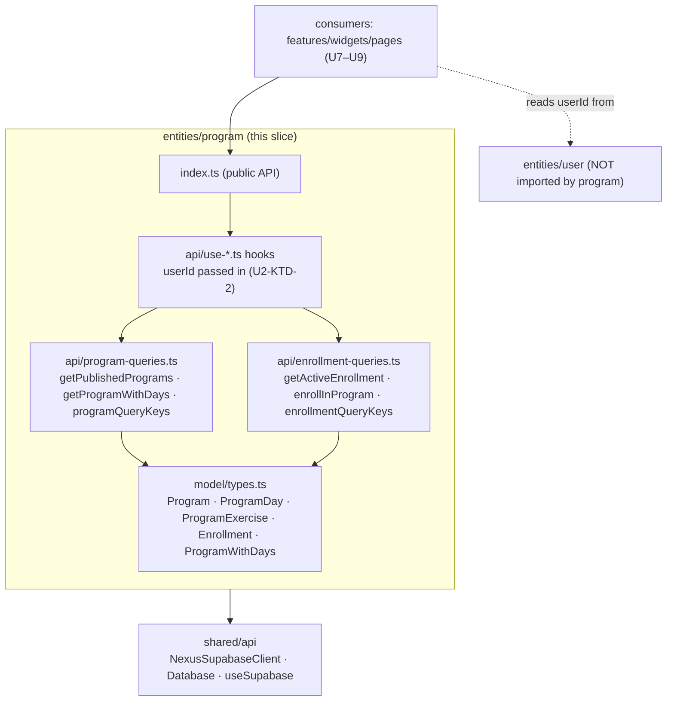
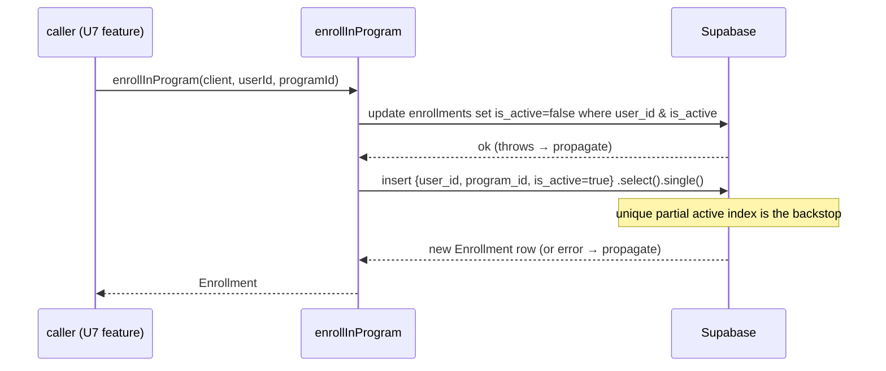

# feat: U2 entities/program slice

## Summary

Implement parent-plan **U2** — the `src/entities/program` read-layer slice that
gives the rest of the app typed access to the program catalog and the user's
active enrollment. Four landable units: catalog/enrollment **types**, **program
catalog queries** (`getPublishedPrograms`, `getProgramWithDays`), **enrollment
queries** (`getActiveEnrollment`, `enrollInProgram`), and **React Query hooks +
public barrel**. The slice mirrors the shipped `src/entities/user` structure and
sits entirely on U1's already-applied schema and types — no migrations, no UI.

The one write path in scope is `enrollInProgram` (the enrollment data
operation); the enrollment *form/button* is parent-plan U7 and out of scope here.

---

## Problem Frame

Parent R1 ("preset program, today's session served up") needs a read layer
before any feature, widget, or page can show a program, resolve today's session
(KTD-6 rotation in parent U8), or enroll a user. U1 shipped the tables, RLS, the
seeded Starting Strength program, and `database.types.ts`; nothing in `src/` yet
reads them.

U2 closes that gap with pure data-access code: typed rows, composite
catalog reads, and enrollment read/activate. It is the dependency for parent
U5 (consistency needs the weekly target `days_per_week`), U7 (`select-program`
feature), U8 (`today-session` widget), and U9 (onboarding gate).

UI, the rotation/"today's session" resolver, scoring, and offline buffering are
**out of scope** (parent U4–U10).

---

## Requirements

- R1. Expose typed `Program`, `ProgramDay`, `ProgramExercise`, and `Enrollment`
  shapes derived from `Database` (parent R1; mirror `src/entities/user/model/types.ts`).
- R2. `getPublishedPrograms(client)` returns published programs (RLS already
  gates `is_published`; the query is an explicit, deterministic read).
- R3. `getProgramWithDays(client, programId)` returns the program with its
  `program_days` sorted by `sort_order`, each carrying its `program_exercises`
  sorted by `sort_order`; returns `null` when not found/visible.
- R4. `getActiveEnrollment(client, userId)` returns the single active enrollment
  row or `null`.
- R5. `enrollInProgram(client, userId, programId)` activates an enrollment for
  the user, deactivating any prior active one, leaving exactly one active row.
- R6. Expose stable, serializable React Query keys for catalog and enrollment
  reads so the persisted cache (`src/app/query-persist.ts`) can serialize them.
- R7. Provide React Query hooks mirroring `src/entities/user/api/use-profile-query.ts`
  for the common reads + the enroll mutation (per resolved scope call-out).
- R8. Public API exposed only through `src/entities/program/index.ts`; no
  cross-slice (same-layer) imports — `eslint-plugin-boundaries` clean.

---

## Key Technical Decisions

**U2-KTD-1 — Mirror the `entities/user` slice layout.** `model/` for types,
`api/` for queries + hooks, a single `index.ts` barrel. Query modules export a
`*QueryKeys` object and plain async functions taking `NexusSupabaseClient` as the
first argument — exactly the shape of
`src/entities/user/api/profile-queries.ts`. This keeps the codebase uniform and
makes the queries trivially unit-testable with a mocked client.

**U2-KTD-2 — `entities/program` must never import `entities/user` (FSD).** Slices
on the same layer cannot import each other (`.cursor/rules/02-fsd.mdc`,
enforced by `eslint-plugin-boundaries`). `entities/user`'s `use-profile-query.ts`
can read its own `useUserStore` because that is *intra-slice*; `entities/program`
has no such store. Therefore **read hooks take `userId` as an explicit
parameter** and `enrollInProgram` takes `userId` explicitly — the consuming
feature/widget/page (which *may* read `entities/user`) passes it down. This is
the central design constraint of the slice.

**U2-KTD-3 — Nested catalog read in one round-trip, sorted in JS.**
`getProgramWithDays` uses a single nested Supabase select
(`programs` → `program_days` → `program_exercises`) and then sorts days and
exercises by `sort_order` in TypeScript before returning. JS sorting (vs.
Supabase `order(..., { referencedTable })`) keeps the function deterministic and
testable against a plain fixture without depending on PostgREST embed-ordering
semantics. One query, no N+1.

**U2-KTD-4 — `enrollInProgram` is deactivate-then-insert, guarded by the DB
index.** Two sequential client calls: (1) `update … set is_active = false where
user_id = … and is_active`, then (2) `insert … is_active = true … select single`.
The unique partial index `user_program_enrollments_one_active_per_user`
(shipped in U1) is the correctness backstop — if a race produced two active rows,
the insert fails rather than corrupting state. Deactivation runs **first** so the
insert never collides with a stale active row. A re-enrollment in the same
program creates a new active row (prior one flipped inactive); duplicate
*historical* rows are acceptable. An atomic Postgres RPC is the cleaner
alternative but requires a new migration (blueprint phase) and is deferred.

**U2-KTD-5 — Errors propagate; no swallowing.** Every query throws on
`error` (matching `profile-queries.ts`). `enrollInProgram` does not catch between
its two statements — a failed deactivate or insert surfaces to the caller so the
mutation reports failure rather than leaving a half-applied state. Reads that
find nothing return `null`/`[]`, not throws.

**U2-KTD-6 — Tests mock a chainable Supabase client; no live DB.** Unit tests
build a fake `NexusSupabaseClient` from `vi.fn()` chains (mirror
`src/features/auth-by-email/api/sign-up.test.ts`). RLS/anon correctness is U1's
proven responsibility; U2 tests cover query *shape*, sort order, null handling,
and the enroll deactivate→insert sequence — pure logic, fast, offline.

---

## High-Level Technical Design

### Slice shape and dependency direction



`entities/program` depends downward on `shared` only. It never imports
`entities/user`; the consumer bridges `userId` (U2-KTD-2).

### `enrollInProgram` sequence (U2-KTD-4 / U2-KTD-5)



### Public API surface

| Export | Kind | Notes |
|--------|------|-------|
| `Program`, `ProgramDay`, `ProgramExercise`, `Enrollment` | types | `Database` Row aliases |
| `ProgramWithDays`, `ProgramDayWithExercises` | types | composite read shapes |
| `getPublishedPrograms`, `getProgramWithDays`, `programQueryKeys` | catalog api | |
| `getActiveEnrollment`, `enrollInProgram`, `enrollmentQueryKeys` | enrollment api | |
| `usePublishedProgramsQuery`, `useProgramWithDaysQuery`, `useActiveEnrollmentQuery`, `useEnrollInProgramMutation` | hooks | hooks accept `userId` where needed |

---

## Output Structure

```text
src/entities/program/
├── model/
│   └── types.ts                     # U2.1
├── api/
│   ├── program-queries.ts           # U2.2
│   ├── program-queries.test.ts      # U2.2
│   ├── enrollment-queries.ts        # U2.3
│   ├── enrollment-queries.test.ts   # U2.3
│   ├── use-program-queries.ts       # U2.4
│   └── use-enrollment.ts            # U2.4
└── index.ts                         # U2.4 (public API)
```

Per-unit `**Files:**` are authoritative; the implementer may refine layout
(e.g., one hook per file) as long as the barrel surface and FSD boundaries hold.

---

## Implementation Units

Dependency-ordered; sub-IDs (U2.1–U2.4) are local to this U2 sub-plan and stable.

### U2.1 — Catalog and enrollment types

**Goal:** Typed row + composite shapes for the slice, derived from `Database`.

**Requirements:** R1.

**Dependencies:** U1 (shipped — `database.types.ts` already includes all five
tables).

**Files:**
- `src/entities/program/model/types.ts`

**Approach:** Alias the U1 generated rows:
`Program = Database['public']['Tables']['programs']['Row']` and likewise for
`ProgramDay`, `ProgramExercise`, and `Enrollment`
(`user_program_enrollments` Row). Add composite read shapes for U2-KTD-3:
`ProgramDayWithExercises = ProgramDay & { exercises: ProgramExercise[] }` and
`ProgramWithDays = Program & { days: ProgramDayWithExercises[] }`. Import
`Database` from `@/shared/api` exactly as `src/entities/user/model/types.ts`
does. No runtime code.

**Patterns to follow:** `src/entities/user/model/types.ts`.

**Test scenarios:** Test expectation: none — types-only unit; covered by
`npm run build` / type-check and by U2.2/U2.3 consuming the types.

**Verification:** `tsc`/build compiles; types reference U1 tables without `any`.

---

### U2.2 — Program catalog queries + keys

**Goal:** Read the published catalog and a single program's full day/exercise tree.

**Requirements:** R2, R3, R6.

**Dependencies:** U2.1.

**Files:**
- `src/entities/program/api/program-queries.ts`
- `src/entities/program/api/program-queries.test.ts`

**Approach:** Export `programQueryKeys` (mirror `profileQueryKeys`):
`{ all: ['program'], published: ['program','published'], withDays: (id) => ['program', id, 'with-days'] }`
— all `as const`, serializable (R6). `getPublishedPrograms(client)`:
`from('programs').select('*').eq('is_published', true).order('name')`, throw on
error, return `data ?? []`. `getProgramWithDays(client, programId)`: single
nested select
`select('*, program_days(*, program_exercises(*))').eq('id', programId).maybeSingle()`;
on `null` return `null`; otherwise map to `ProgramWithDays`, sorting `days` and
each day's `exercises` by `sort_order` ascending in JS (U2-KTD-3). Throw on error
(U2-KTD-5). Take `NexusSupabaseClient` as the first arg.

**Patterns to follow:** `src/entities/user/api/profile-queries.ts` (fn shape,
`maybeSingle`, error throw); `src/features/auth-by-email/api/sign-up.test.ts`
(mock-client test shape).

**Test scenarios:**
- Covers R2. `getPublishedPrograms` returns the rows the mocked client yields and
  applies the `is_published = true` filter; empty result → `[]` (no throw).
- Covers R3. `getProgramWithDays` returns days sorted by `sort_order` with each
  day's exercises sorted by `sort_order`, even when the mock returns them
  unsorted.
- Covers R3. Unknown/invisible `programId` (mock `maybeSingle` → `null`) returns
  `null`.
- Covers R6. `programQueryKeys.withDays(id)` is a stable, serializable array; same
  input → equal key.
- A Supabase `error` response causes the function to throw (U2-KTD-5).

**Verification:** `npm run test:unit` passes; no live DB; functions throw on
error and never return `undefined`.

---

### U2.3 — Enrollment queries + keys

**Goal:** Read the active enrollment and activate a program (deactivating prior).

**Requirements:** R4, R5, R6.

**Dependencies:** U2.1.

**Files:**
- `src/entities/program/api/enrollment-queries.ts`
- `src/entities/program/api/enrollment-queries.test.ts`

**Approach:** Export `enrollmentQueryKeys`:
`{ all: ['enrollment'], active: (userId) => ['enrollment', userId, 'active'] }`
(`as const`, R6). `getActiveEnrollment(client, userId)`:
`from('user_program_enrollments').select('*').eq('user_id', userId).eq('is_active', true).maybeSingle()`
→ `Enrollment | null`, throw on error. `enrollInProgram(client, userId,
programId)` per U2-KTD-4: (1) `update({ is_active: false })` where
`user_id = userId` and `is_active = true`; throw on error; (2)
`insert({ user_id: userId, program_id: programId, is_active: true }).select().single()`;
throw on error; return the new `Enrollment`. No catch between steps (U2-KTD-5).
`userId` is an explicit param (U2-KTD-2) — do **not** import `entities/user`.

**Patterns to follow:** `src/entities/user/api/profile-queries.ts`; U1 index
`user_program_enrollments_one_active_per_user` (correctness backstop).

**Test scenarios:**
- Covers R4. `getActiveEnrollment` returns the active row from the mock; returns
  `null` when none (mock `maybeSingle` → `null`).
- Covers R5. `enrollInProgram` calls the deactivate update (filtered to
  `user_id` + `is_active`) **before** the insert, and returns the inserted active
  row (assert call order via mock).
- Covers R5 / U2-KTD-5. Insert error (e.g., simulated unique-index conflict)
  propagates as a throw; a failed deactivate short-circuits before insert.
- Covers R6. `enrollmentQueryKeys.active(userId)` is stable/serializable.

**Verification:** `npm run test:unit` passes; deactivate-then-insert order
asserted; errors propagate.

---

### U2.4 — React Query hooks + public barrel

**Goal:** Thin hooks for consumers (U7–U9) and the slice's single public API.

**Requirements:** R7, R8.

**Dependencies:** U2.2, U2.3.

**Files:**
- `src/entities/program/api/use-program-queries.ts`
- `src/entities/program/api/use-enrollment.ts`
- `src/entities/program/index.ts`

**Approach:** Mirror `src/entities/user/api/use-profile-query.ts`: each hook calls
`useSupabase()` and wraps the U2.2/U2.3 functions. `usePublishedProgramsQuery()`
→ `useQuery({ queryKey: programQueryKeys.published, queryFn })`.
`useProgramWithDaysQuery(programId?: string)` → keyed on
`programQueryKeys.withDays(programId ?? '')`, `enabled: Boolean(programId)`.
`useActiveEnrollmentQuery(userId: string | null)` → keyed on
`enrollmentQueryKeys.active(userId ?? '')`, `enabled: Boolean(userId)` — `userId`
passed in (U2-KTD-2), never read from a store. `useEnrollInProgramMutation()` →
`useMutation` calling `enrollInProgram`, invalidating `enrollmentQueryKeys.all`
(or `.active(userId)`) on success. Give reads a sensible `staleTime` (catalog is
static; reuse the 60s convention or longer). The barrel re-exports the public
surface in the table above and nothing else (R8).

**Patterns to follow:** `src/entities/user/api/use-profile-query.ts`;
`src/entities/user/index.ts` (barrel shape); `src/app/query-persist.ts` (keys
must stay serializable).

**Test scenarios:** Test expectation: none — thin hooks matching the untested
`use-profile-query.ts` precedent; logic lives in U2.2/U2.3 (tested) and behavior
is exercised end-to-end in parent U7–U10. (If the implementer prefers, a
`renderHook` + `QueryClientProvider` smoke test for `enabled` gating is welcome
but not required.)

**Verification:** `npm run lint` (incl. `eslint-plugin-boundaries`) clean — no
`entities/user` import; `npm run lint:ctx` and `npm run build` clean; barrel
exposes only the documented API.

---

## Scope Boundaries

### In scope
- The `src/entities/program` slice: types, catalog queries, enrollment
  queries (read + `enrollInProgram`), React Query hooks, public barrel, and unit
  tests for the query modules.

### Outside U2 (parent plan)
- `select-program` feature UI / `StartProgramButton` (parent U7).
- "Today's session" rotation resolver / KTD-6 logic (parent U8 widget).
- Readiness, workout, consistency, knowledge slices (parent U3–U6).
- Onboarding page + enrollment gate (parent U9).

### Deferred to follow-up work
- Atomic `enrollInProgram` via a Postgres RPC (needs a migration → blueprint
  phase); revisit only if deactivate-then-insert races appear in practice
  (U2-KTD-4).
- No-op short-circuit when re-enrolling in the already-active program (current
  behavior creates a fresh active row + inactive history row — acceptable).
- `renderHook` tests for the U2.4 hooks (pattern parity: `use-profile-query.ts`
  is untested today).

---

## Risks and Dependencies

| Risk | Mitigation |
|------|------------|
| Accidental `entities/user` import for `userId` | U2-KTD-2: hooks/fns take `userId` param; `eslint-plugin-boundaries` fails the build on violation |
| `enrollInProgram` race → two active rows | Deactivate-then-insert order + U1 unique partial active index as backstop (U2-KTD-4) |
| Nested embed ordering surprises | Sort days/exercises in JS, not via PostgREST embed order (U2-KTD-3) |
| Query keys not serializable → breaks persisted cache | Plain `as const` array keys mirroring `profileQueryKeys` (R6) |
| Half-applied enroll on mid-sequence failure | Errors propagate, mutation reports failure; no swallow (U2-KTD-5) |

**Dependencies:** U1 (shipped) — migrations
`20260603120000_mvp_programs_catalog.sql`,
`20260603120100_mvp_user_training.sql`,
`20260603120200_mvp_seed_default_program.sql`, and the extended
`src/shared/api/database.types.ts`. React Query + `useSupabase` provider
(`src/shared/api`), persisted cache (`src/app/query-persist.ts`).

---

## Acceptance Examples

- **AE1.** `getPublishedPrograms` returns only published programs and `[]` when
  none (R2).
- **AE2.** `getProgramWithDays` returns `ProgramWithDays` with `days` and nested
  `exercises` ordered by `sort_order`, regardless of source order (R3).
- **AE3.** `getProgramWithDays` returns `null` for an unknown/invisible program (R3).
- **AE4.** `getActiveEnrollment` returns the single active row or `null` (R4).
- **AE5.** `enrollInProgram` deactivates any prior active enrollment before
  inserting, leaving exactly one active row, and returns it (R5).
- **AE6.** A Supabase error in any query/mutation propagates as a throw; no
  partial enroll state is hidden (U2-KTD-5).
- **AE7.** `programQueryKeys` / `enrollmentQueryKeys` are stable and serializable (R6).
- **AE8.** `npm run lint` passes with no same-layer import; the slice's only
  public entry is `index.ts` (R8).

---

## Open Questions

### Resolved in this plan
- React Query surface → ship query fns + keys **and** thin hooks (U2-KTD-1, R7).
- `userId` access under FSD → passed as a parameter; never import `entities/user`
  (U2-KTD-2).
- Enroll atomicity → deactivate-then-insert + DB index backstop; RPC deferred
  (U2-KTD-4).
- Catalog ordering → JS sort by `sort_order` (U2-KTD-3).

### Deferred to implementation (ce-work)
- Exact `staleTime` values per read (catalog is effectively static; pick a
  generous value).
- Whether to split each hook into its own file vs. the two grouped files above
  (either satisfies the barrel/FSD contract).

---

## Sources and Research

- Origin / blueprint: `docs/plans/2026-06-02-001-feat-mvp-adherence-loop-plan.md`
  (parent U2 spec, KTD-1).
- Slice pattern: `src/entities/user/model/types.ts`,
  `src/entities/user/api/profile-queries.ts`,
  `src/entities/user/api/use-profile-query.ts`, `src/entities/user/index.ts`.
- Test/mock pattern: `src/features/auth-by-email/api/sign-up.test.ts`.
- Schema/types in play: `src/shared/api/database.types.ts`,
  `supabase/migrations/20260603120000_mvp_programs_catalog.sql`,
  `supabase/migrations/20260603120100_mvp_user_training.sql`.
- FSD rules: `.cursor/rules/02-fsd.mdc` (enforced via `eslint-plugin-boundaries`).
