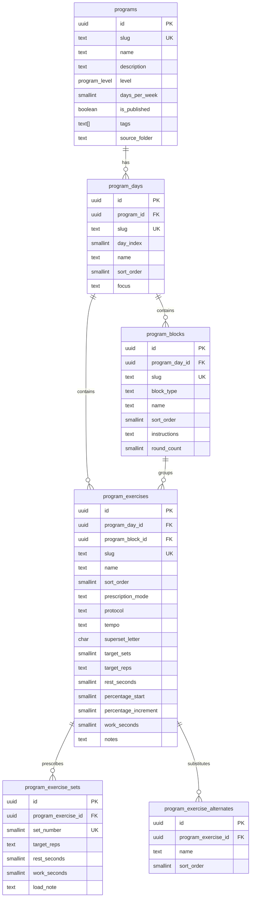

# feat: Fitness catalog schema for Drive workout plans

## Summary

Extend the existing `programs` / `program_days` / `program_exercises` catalog (shipped in
`20260603120000_mvp_programs_catalog.sql`) so it can represent the **25 programs / 103
workout-day PDFs** under `G:\My Drive\1 Project\_Fitness\Workout Plans` without breaking
the seeded Starting Strength MVP.

The Drive corpus is hypertrophy-focused (rep ranges, tempo, alternates, supersets,
percentage-based SBD work, and HIIT intervals). The current three-column prescription
(`target_sets`, `target_reps`, `rest_seconds`) is sufficient for Starting Strength only.

**Approved gate:** Human review of this plan before `supabase migration new`.

---

## Drive corpus inventory

| Days/week | Programs | Day PDFs | Notes |
|-----------|----------|----------|-------|
| 3 | 9 | 27 | PPL, minimalist, full body, female, dumbbells, travel circuits |
| 4 | 9 | 36 | Beach body, female variants, HIIT, bodyweight, science-based |
| 5 | 5 | 25 | Muscle builder, powerbuilding, SBD strength, female, dumbbells |
| 6 | 2 | 12 | PPL, female PPL, muscle builder |
| **Total** | **25** | **103** | |

### Recurring prescription patterns (from PDF text extraction)

1. **Double progression** — same rep range every set (e.g. `8-10` × 2 sets).
2. **Top set + back-off** — set 1 lower reps / heavier, sets 2–3 higher reps at reduced load
   (e.g. `6-8`, `10-12`, `10-12` with 180s rest).
3. **Percentage-based main lifts** — SBD Strength: barbell squat/bench/deadlift at
   `75% 1RM` week 1, +5%/week, 1RM test week 5.
4. **Supersets** — labeled `3A` / `3B`, shared round count (2–4 sets).
5. **Travel circuits** — single superset block, 4 rounds, bodyweight.
6. **HIIT intervals** — time-based (`30s work / 30s rest`), not rep-based.
7. **Warm-up blocks** — freestyle lists (band dislocates, cardio); not logged as sets.

### Slug convention for import

```
{days_per_week}-{kebab-name}     e.g. 3-push-pull-legs, 6-muscle-builder
{day_slug} from PDF filename     e.g. push, upper-a, circuit-1
{exercise_slug} from name        e.g. incline-smith-chest-press
```

Disambiguate duplicate display names (`5 Muscle Builder` vs `6 Muscle Builder`) via the
`days_per_week` prefix in `programs.slug`.

---

## Program descriptions and difficulty levels

`programs.description` already exists on the MVP schema but is nullable and only populated
for Starting Strength. For the Drive catalog, **every program row must ship with a
non-null `description`** — 1–3 sentences covering split style, audience, and equipment.

Add a **`level`** column (`beginner` | `intermediate` | `advanced`) for catalog filtering
and onboarding recommendations. This is distinct from `tags` (equipment/audience facets).

### Level classification methodology

Levels were assigned by analyzing all 103 PDFs across these signals:

| Signal | Beginner tilt | Advanced tilt |
|--------|---------------|---------------|
| Weekly frequency | 3×/week, circuits | 5–6×/week |
| Equipment | Bodyweight, travel, minimal home, 3-day DB | Full gym, barbell % blocks |
| Protocol complexity | Double progression only | Top-set/back-off, supersets, % 1RM waves |
| Session structure | HIIT with explicit beginner scaling | SBD 5-week max-test block |
| Recovery demand | Low exercise count, no 2× PPL | 6-day PPL / muscle builder |

Manual overrides applied where heuristics misread PDF structure (e.g. 3 Female is
intermediate despite 3× frequency because of specialization; 6 Female PPL is
intermediate — high frequency but lower per-session volume than 6 PPL).

### Catalog: slug, level, description

| Slug | Level | Description |
|------|-------|-------------|
| `3-dumbbells` | beginner | Three-day dumbbell-only split covering strength, unilateral work, and conditioning. Minimal equipment; ideal for home or busy gyms. |
| `3-female` | intermediate | Three-day female-focused split with upper, lower/glute, and glute-bias sessions. Balanced hypertrophy with lower-body emphasis. |
| `3-full-body` | beginner | Three-day full-body rotation across upper, lower, and combined sessions. Efficient frequency for general strength and muscle. |
| `3-minimal-home` | beginner | Three-day minimal-equipment full-body program (A/B/C). Built for home training with limited gear. |
| `3-minimalist` | beginner | Streamlined three-day upper/lower/full-body split with low exercise count per session. High signal-to-noise for time-crunched lifters. |
| `3-plfull-body` | intermediate | Three-day full-body program biased toward push, pull, or legs each session. Hybrid between PPL and full-body training. |
| `3-push-pull-legs` | intermediate | Classic three-day PPL split. Push, pull, and leg days with compound and accessory work, top-set/back-off progression on main lifts. |
| `3-travel` | beginner | Hotel/travel circuit program with three no-equipment circuits. Bodyweight supersets for maintaining fitness on the road. |
| `4-beach-body` | intermediate | Four-day physique split: push, pull, upper, and legs. Hypertrophy focus for balanced upper/lower development. |
| `4-bodyweight` | beginner | Four-day bodyweight-only program. No gym required; scalable progressions using tempo and density. |
| `4-female-minimalist` | beginner | Four-day female minimalist split (upper A/B, legs A/B). Low volume per session with double-progression loading. |
| `4-female-plpl` | intermediate | Four-day female push/pull/legs/legs rotation. Extra lower-body frequency with moderate upper volume. |
| `4-female-specialized` | intermediate | Four-day female specialization split targeting squats, legs, back, and delts. Weak-point emphasis for intermediate lifters. |
| `4-home-hiit` | beginner | Four-day home HIIT program with timed intervals. Beginner and advanced scaling via work/rest and load; fat-loss and conditioning focus. |
| `4-minimalist` | intermediate | Four-day minimalist hypertrophy split with reduced exercise count. Efficient sessions for intermediate trainees. |
| `4-muscle-builder` | intermediate | Four-day muscle-building split with moderate-to-high volume. Standard hypertrophy protocols with top-set/back-off on compounds. |
| `4-science-based` | intermediate | Four-day evidence-informed hypertrophy program. Volume and frequency aligned with current research on muscle growth. |
| `5-dumbbells` | intermediate | Five-day dumbbell hypertrophy program. Higher frequency with DB-only movements for home or limited-equipment gyms. |
| `5-female` | intermediate | Five-day female hypertrophy split with dedicated upper and leg sessions. Higher weekly frequency for lower and upper development. |
| `5-muscle-builder` | intermediate | Five-day muscle-building split with elevated weekly volume. Multiple sessions per muscle group for intermediate-to-advanced hypertrophy. |
| `5-powerbuilding` | advanced | Five-day powerbuilding split (push, pull, upper, quads, hamstrings). Heavy compounds plus hypertrophy accessories; requires solid lifting experience. |
| `5-sbd-strength` | advanced | Five-day squat/bench/deadlift strength block with percentage-based main lifts. Requires known or estimated 1RMs; 5-week wave culminating in max testing. |
| `6-female-ppl` | intermediate | Six-day female PPL (two rounds per week). High frequency hypertrophy for experienced female lifters who recover well. |
| `6-muscle-builder` | advanced | Six-day muscle-building split — highest frequency in the catalog. Advanced volume and recovery demands. |
| `6-ppl` | advanced | Six-day PPL (two rounds per week). High-frequency hypertrophy for advanced lifters comfortable with push/pull/legs twice weekly. |

**Distribution:** 8 beginner · 13 intermediate · 4 advanced

Starting Strength (`starting-strength-mvp`) remains **intermediate** — simple protocol but
assumes barbell competency; set during seed update.

Reproducible analysis: `scripts/_analyze_program_levels.py`.

---

## Schema design

### ER diagram (extensions in bold)



### Design decisions

| ID | Decision | Rationale |
|----|----------|-----------|
| D1 | Keep legacy `target_sets` / `target_reps` / `rest_seconds` | Starting Strength + simple UI fallback; no breaking change to U2 entity types. |
| D2 | Add `program_exercise_sets` child rows | Per-set rep/rest variance (top-set backoff) is the dominant pattern in Drive PDFs. |
| D3 | Add `program_blocks` for warmup / superset / interval sections | Warmups are instructional, not set-logged; supersets need shared round count. |
| D4 | `prescription_mode` enum on exercise | `sets_reps` (default), `time_interval` (HIIT), `percentage_1rm` (SBD main lifts). |
| D5 | `tags text[]` on programs | Filter UI: `female`, `dumbbells`, `bodyweight`, `travel`, `hiit`, `strength`. |
| D6 | No `program_weeks` table in v1 | SBD % progression computed client-side from `percentage_start` + week index; catalog stays static. |
| D7 | RLS mirrors existing catalog pattern | SELECT for `authenticated` when parent program `is_published`; `REVOKE` from `anon`. |
| D8 | `level program_level` on programs | Required for catalog rows; `beginner` \| `intermediate` \| `advanced` from PDF analysis. |
| D9 | `description` required at seed time | Nullable in DB for backward compat; import script rejects programs without copy. |

### Backward compatibility

- Existing rows: `prescription_mode = 'sets_reps'`, no child sets required.
- Readers: if `program_exercise_sets` count > 0, use child rows; else synthesize N identical sets
  from `target_sets` + `target_reps` + `rest_seconds`.

---

## Proposed migration SQL

File name (after approval): `supabase/migrations/20260604120000_fitness_catalog_extensions.sql`

```sql
-- Fitness catalog extensions for Drive workout plans.
-- Extends MVP programs schema; backward-compatible with Starting Strength seed.

-- -----------------------------------------------------------------------------
-- Enums (idempotent)
-- -----------------------------------------------------------------------------
do $$ begin
  create type public.program_block_type as enum (
    'warmup',
    'workout',
    'superset',
    'interval_circuit'
  );
exception
  when duplicate_object then null;
end $$;

do $$ begin
  create type public.exercise_prescription_mode as enum (
    'sets_reps',
    'time_interval',
    'percentage_1rm'
  );
exception
  when duplicate_object then null;
end $$;

do $$ begin
  create type public.exercise_protocol as enum (
    'double_progression',
    'top_set_backoff',
    'percentage_block',
    'interval_progression',
    'circuit'
  );
exception
  when duplicate_object then null;
end $$;

do $$ begin
  create type public.program_level as enum (
    'beginner',
    'intermediate',
    'advanced'
  );
exception
  when duplicate_object then null;
end $$;

-- -----------------------------------------------------------------------------
-- public.programs — metadata for catalog filtering
-- -----------------------------------------------------------------------------
alter table public.programs
  add column if not exists tags text[] not null default '{}',
  add column if not exists source_folder text,
  add column if not exists level public.program_level;

comment on column public.programs.description is
  'Catalog summary (1–3 sentences): split style, audience, equipment. Required for seeded Drive programs.';
comment on column public.programs.level is
  'Difficulty tier for catalog filtering and onboarding recommendations.';
comment on column public.programs.tags is
  'Catalog facets, e.g. female, dumbbells, bodyweight, travel, hiit, strength.';
comment on column public.programs.source_folder is
  'Import traceability; matches Drive folder name.';

-- Backfill existing MVP seed
update public.programs
set
  level = 'intermediate',
  description = coalesce(
    description,
    'MVP two-workout A/B template (barbell row on B). Train 3×/week; rotate A → B → A → B.'
  )
where slug = 'starting-strength-mvp'
  and level is null;

create index if not exists idx_programs_level on public.programs (level)
  where is_published = true;

-- -----------------------------------------------------------------------------
-- public.program_days — day focus label
-- -----------------------------------------------------------------------------
alter table public.program_days
  add column if not exists focus text;

comment on column public.program_days.focus is
  'Day emphasis: push, pull, legs, upper, lower, circuit-1, etc.';

-- -----------------------------------------------------------------------------
-- public.program_blocks — warmup, main, superset, interval sections
-- -----------------------------------------------------------------------------
create table if not exists public.program_blocks (
  id uuid not null default gen_random_uuid() primary key,
  program_day_id uuid not null references public.program_days (id) on delete cascade,
  slug text not null,
  block_type public.program_block_type not null default 'workout',
  name text not null,
  sort_order smallint not null,
  instructions text,
  round_count smallint,
  constraint program_blocks_program_day_id_slug_key unique (program_day_id, slug),
  constraint program_blocks_sort_order_check check (sort_order > 0),
  constraint program_blocks_round_count_check check (round_count is null or round_count > 0)
);

comment on table public.program_blocks is
  'Section within a program day: warmup instructions, main work, superset, or HIIT circuit.';

create index if not exists idx_program_blocks_program_day_id
  on public.program_blocks (program_day_id);

-- -----------------------------------------------------------------------------
-- public.program_exercises — extended prescription
-- -----------------------------------------------------------------------------
alter table public.program_exercises
  add column if not exists program_block_id uuid references public.program_blocks (id) on delete set null,
  add column if not exists prescription_mode public.exercise_prescription_mode not null default 'sets_reps',
  add column if not exists protocol public.exercise_protocol,
  add column if not exists tempo text,
  add column if not exists superset_letter char(1),
  add column if not exists percentage_start smallint,
  add column if not exists percentage_increment smallint,
  add column if not exists work_seconds smallint;

alter table public.program_exercises
  add constraint program_exercises_superset_letter_check
  check (superset_letter is null or superset_letter ~ '^[A-Z]$');

alter table public.program_exercises
  add constraint program_exercises_percentage_start_check
  check (percentage_start is null or (percentage_start > 0 and percentage_start <= 100));

alter table public.program_exercises
  add constraint program_exercises_percentage_increment_check
  check (percentage_increment is null or (percentage_increment > 0 and percentage_increment <= 25));

comment on column public.program_exercises.prescription_mode is
  'sets_reps (default), time_interval (HIIT), percentage_1rm (SBD main lifts).';
comment on column public.program_exercises.protocol is
  'Progression model from PDF protocol sheet.';
comment on column public.program_exercises.tempo is
  'Tempo prescription, e.g. 3-1-X-1.';
comment on column public.program_exercises.superset_letter is
  'A/B/C within a superset block; null for straight sets.';
comment on column public.program_exercises.percentage_start is
  'Week-1 working percentage of 1RM for percentage_1rm mode.';
comment on column public.program_exercises.percentage_increment is
  'Weekly % increase until 1RM test week (typically +5).';
comment on column public.program_exercises.work_seconds is
  'Default work interval for time_interval mode when sets table omitted.';

create index if not exists idx_program_exercises_program_block_id
  on public.program_exercises (program_block_id);

-- -----------------------------------------------------------------------------
-- public.program_exercise_sets — per-set prescription
-- -----------------------------------------------------------------------------
create table if not exists public.program_exercise_sets (
  id uuid not null default gen_random_uuid() primary key,
  program_exercise_id uuid not null references public.program_exercises (id) on delete cascade,
  set_number smallint not null,
  target_reps text,
  rest_seconds smallint,
  work_seconds smallint,
  load_note text,
  constraint program_exercise_sets_exercise_set_key unique (program_exercise_id, set_number),
  constraint program_exercise_sets_set_number_check check (set_number > 0),
  constraint program_exercise_sets_prescription_check check (
    target_reps is not null
    or work_seconds is not null
    or load_note is not null
  )
);

comment on table public.program_exercise_sets is
  'Per-set reps/rest/work/load; preferred over flat target_* when present.';

create index if not exists idx_program_exercise_sets_program_exercise_id
  on public.program_exercise_sets (program_exercise_id);

-- -----------------------------------------------------------------------------
-- public.program_exercise_alternates — substitution list from PDFs
-- -----------------------------------------------------------------------------
create table if not exists public.program_exercise_alternates (
  id uuid not null default gen_random_uuid() primary key,
  program_exercise_id uuid not null references public.program_exercises (id) on delete cascade,
  name text not null,
  sort_order smallint not null,
  constraint program_exercise_alternates_exercise_sort_key unique (program_exercise_id, sort_order),
  constraint program_exercise_alternates_sort_order_check check (sort_order > 0)
);

comment on table public.program_exercise_alternates is
  'Alternate exercises listed on each PDF movement.';

create index if not exists idx_program_exercise_alternates_program_exercise_id
  on public.program_exercise_alternates (program_exercise_id);

-- -----------------------------------------------------------------------------
-- RLS (published-catalog pattern)
-- -----------------------------------------------------------------------------
alter table public.program_blocks enable row level security;

drop policy if exists "program_blocks_select_published" on public.program_blocks;
create policy "program_blocks_select_published"
  on public.program_blocks
  for select
  to authenticated
  using (
    exists (
      select 1
      from public.program_days pd
      join public.programs p on p.id = pd.program_id
      where pd.id = program_blocks.program_day_id
        and p.is_published = true
    )
  );

alter table public.program_exercise_sets enable row level security;

drop policy if exists "program_exercise_sets_select_published" on public.program_exercise_sets;
create policy "program_exercise_sets_select_published"
  on public.program_exercise_sets
  for select
  to authenticated
  using (
    exists (
      select 1
      from public.program_exercises pe
      join public.program_days pd on pd.id = pe.program_day_id
      join public.programs p on p.id = pd.program_id
      where pe.id = program_exercise_sets.program_exercise_id
        and p.is_published = true
    )
  );

alter table public.program_exercise_alternates enable row level security;

drop policy if exists "program_exercise_alternates_select_published" on public.program_exercise_alternates;
create policy "program_exercise_alternates_select_published"
  on public.program_exercise_alternates
  for select
  to authenticated
  using (
    exists (
      select 1
      from public.program_exercises pe
      join public.program_days pd on pd.id = pe.program_day_id
      join public.programs p on p.id = pd.program_id
      where pe.id = program_exercise_alternates.program_exercise_id
        and p.is_published = true
    )
  );

-- -----------------------------------------------------------------------------
-- Grants and anon default-deny
-- -----------------------------------------------------------------------------
grant select on table public.program_blocks to authenticated;
grant select on table public.program_exercise_sets to authenticated;
grant select on table public.program_exercise_alternates to authenticated;

revoke all on table public.program_blocks from anon;
revoke all on table public.program_exercise_sets from anon;
revoke all on table public.program_exercise_alternates from anon;
```

---

## Example seed shape (3 Push Pull Legs — Push day)

Illustrates how one PDF maps to the extended schema. Full 103-day seed is a follow-on
import script (`scripts/seed-fitness-catalog.ts`), not this migration.

```sql
-- Program
insert into public.programs (slug, name, description, level, days_per_week, is_published, tags, source_folder)
values (
  '3-push-pull-legs',
  '3 Day Push / Pull / Legs',
  'Classic three-day PPL split. Push, pull, and leg days with compound and accessory work, top-set/back-off progression on main lifts.',
  'intermediate',
  3,
  false,
  array['hypertrophy'],
  '3 Push Pull Legs'
)
on conflict (slug) do update set
  name = excluded.name,
  description = excluded.description,
  level = excluded.level,
  days_per_week = excluded.days_per_week,
  tags = excluded.tags,
  source_folder = excluded.source_folder;

-- Day
insert into public.program_days (program_id, slug, day_index, name, sort_order, focus)
select p.id, 'push', 1, 'Push', 1, 'push'
from public.programs p where p.slug = '3-push-pull-legs'
on conflict (program_id, slug) do update set
  day_index = excluded.day_index,
  name = excluded.name,
  sort_order = excluded.sort_order,
  focus = excluded.focus;

-- Block + exercise + sets + alternates (Incline Smith Chest Press)
with day as (
  select pd.id
  from public.program_days pd
  join public.programs p on p.id = pd.program_id
  where p.slug = '3-push-pull-legs' and pd.slug = 'push'
),
blk as (
  insert into public.program_blocks (program_day_id, slug, block_type, name, sort_order)
  select day.id, 'main-workout', 'workout', 'Workout — Regular', 2
  from day
  on conflict (program_day_id, slug) do update set name = excluded.name
  returning id, program_day_id
),
ex as (
  insert into public.program_exercises (
    program_day_id, program_block_id, slug, name, sort_order,
    prescription_mode, protocol, tempo,
    target_sets, target_reps, rest_seconds
  )
  select
    blk.program_day_id, blk.id,
    'incline-smith-chest-press', 'Incline Smith Chest Press', 1,
    'sets_reps', 'top_set_backoff', '3-1-X-1',
    3, '6-12', 180
  from blk
  on conflict (program_day_id, slug) do update set
    name = excluded.name,
    protocol = excluded.protocol,
    tempo = excluded.tempo
  returning id
)
insert into public.program_exercise_sets (program_exercise_id, set_number, target_reps, rest_seconds)
select ex.id, v.set_number, v.target_reps, v.rest_seconds
from ex
cross join (values (1::smallint, '6-8', 180::smallint), (2, '10-12', 180), (3, '10-12', 180)) as v (set_number, target_reps, rest_seconds)
on conflict (program_exercise_id, set_number) do update set
  target_reps = excluded.target_reps,
  rest_seconds = excluded.rest_seconds;

insert into public.program_exercise_alternates (program_exercise_id, name, sort_order)
select pe.id, v.name, v.sort_order
from public.program_exercises pe
join public.program_days pd on pd.id = pe.program_day_id
join public.programs p on p.id = pd.program_id
cross join (values
  ('Plate Loaded Incline Chest Press', 1::smallint),
  ('Cybex Incline Chest Press Machine', 2),
  ('Incline Dumbbell Bench Press', 3)
) as v (name, sort_order)
where p.slug = '3-push-pull-legs'
  and pd.slug = 'push'
  and pe.slug = 'incline-smith-chest-press'
on conflict (program_exercise_id, sort_order) do update set name = excluded.name;
```

---

## Follow-on work (out of scope for this migration)

1. **PDF import script** — parse 103 PDFs → idempotent seed SQL/JSON (stable slugs from filenames).
2. **`database.types.ts` regen** — after migration apply.
3. **U2 entity extension** — nested select for blocks, sets, alternates; set-log UI reads per-set rows.
4. **SBD week resolver** — client feature: `weekNumber → percentage_start + (n-1)*percentage_increment`.
5. **Publish gate** — seed all programs with `is_published = false`; flip individually after QA.

---

## Verification (post-apply)

```bash
supabase db lint
# Manual: Starting Strength still readable with legacy columns only
# Manual: 3-push-pull-legs push day returns 3 sets for incline-smith-chest-press
```
