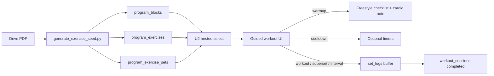

# feat: Include warmup and cooldown sections in fitness catalog

## Summary

Seed **structured warmup and cooldown** sections from Drive PDFs: warmup blocks get
parsed pre-activation exercises (today only a comma-separated `instructions` blob);
cooldown blocks are currently **discarded** by the import script. Both bookends surface
in catalog and guided workout UI as **display-only** — not `set_logs`. Main work remains
the only loggable region; session adherence stays day-level after main blocks complete.

---

## Problem Frame

The fitness catalog import (`scripts/generate_exercise_seed.py`) handles warmup and
cooldown asymmetrically:

| Section | Today | Gap |
|---------|-------|-----|
| **Warmup** | `program_blocks` row with `instructions` from `LIST OF EXERCISES:` | No `program_exercises`; guided UI cannot show a per-movement checklist |
| **Cooldown** | Detected in PDFs but **dropped** in `split_blocks()` | Enum has no `cooldown` value; zero seed rows |

Drive PDFs structure both bookends differently:

- **Warmup:** Freestyle pre-activation — 5 min cardio preamble + comma-separated movement
  list (e.g. band dislocates, pull-aparts, rotator work). No per-exercise reps/rest.
- **Cooldown:** OPTIONAL numbered stretches with time holds (10 sec, 1 min, 5 min walk).

Origin plan D3 said warmups are “instructional, not set-logged.” That remains true for
**logging** — but the catalog should still model named warmup movements for display.

---

## Requirements

| ID | Requirement |
|----|-------------|
| R1 | Extend `program_block_type` with `cooldown` (blueprint-approved migration). `warmup` already exists. |
| R2 | Import script seeds **warmup exercises** parsed from `LIST OF EXERCISES` / `LIST F EERCISES` (OCR). |
| R3 | Import script seeds **cooldown blocks and exercises** for all PDFs that contain them. |
| R4 | Warmup block retains preamble `instructions` (5 min cardio + freestyle note). |
| R5 | Cooldown exercises use `prescription_mode = time_interval` with `work_seconds` / per-set rows. |
| R6 | Warmup exercises use a display-only prescription (freestyle checklist — see KTD3). |
| R7 | Warmup and cooldown are **optional** in guided UX — skipping does not affect adherence (KTD-3). |
| R8 | Bookend exercises are **not written to `set_logs`** in MVP guided flow. |
| R9 | Block-aware catalog query returns blocks in order: warmup → main → cooldown. |
| R10 | Days missing a bookend section produce no placeholder block for that section. |

Traceability: extends fitness catalog plan D3 with explicit bookend semantics (KTD1, KTD3).

---

## Key Technical Decisions

### KTD1 — Structured blocks + exercises, display-only (not set-logged)

**Decision:** Seed `program_exercises` under both `warmup` and `cooldown` blocks. Guided
UI shows checklists/timers but does **not** flush bookend completion to `set_logs`.

**Rationale:** PDFs name specific movements in both sections. Logging bookends would
pollute lift history / weight pre-fill. Adherence is session-day based
(`docs/plans/2026-06-02-001-feat-mvp-adherence-loop-plan.md` KTD-3).

**Rejected:** Instructions-only warmup (current seed) — loses per-movement checklist UX.
**Deferred:** Loggable mobility streaks — revisit if product asks.

### KTD2 — Session completion gate after main work

**Decision:** User may complete (`workout_session.status = 'completed'`) after all
**loggable** main-block exercises are addressed. Warmup is a **dismissible pre-main**
step; cooldown is a **skippable post-main** step. Neither gates flush.

**Rationale:** Warmup is preparatory; cooldown PDF says OPTIONAL.

### KTD3 — Warmup vs cooldown prescription shape

**Decision:**

| Block | `prescription_mode` | Prescription detail |
|-------|---------------------|---------------------|
| `warmup` | `sets_reps` (default) | `target_sets = 1`, `target_reps = 'freestyle'`, no per-set rows; optional block-level cardio note in `instructions` |
| `cooldown` | `time_interval` | `work_seconds` + `program_exercise_sets` for varied holds |

**Rationale:** Warmup PDFs do not prescribe reps/rest per movement. Cooldown PDFs do
prescribe durations. Reusing `sets_reps` with a sentinel `target_reps` avoids a new enum
value; UI keys off `block_type` for rendering (checklist vs timer).

### KTD4 — Loggability from `block_type` only

**Decision:** `isLoggableBlock(type)` → true for `workout`, `superset`, `interval_circuit`
only. `warmup` and `cooldown` → display-only.

**Rationale:** No `is_loggable` column in v1.

### KTD5 — Blueprint gate before migration

**Decision:** Human approval of this plan before `supabase migration new` per `AGENTS.md`.

**Rationale:** `cooldown` enum addition is a schema change.

### KTD6 — Warmup list parsing

**Decision:** Split `LIST OF EXERCISES:` (and OCR variants) on commas with OCR
normalization; emit one `program_exercise` per item with stable slugs. Deduplicate within
a day. Keep full list in `instructions` for backward-compatible display fallback.

**Rationale:** Comma lists are the only structured warmup data in PDFs; no set tables.

---

## High-Level Technical Design



**Block ordering per day:** `warmup` (1) → main blocks → `cooldown` (last).

**Parser changes:**

1. **Warmup:** Parse comma list into exercises; stop `continue`-ing before exercise loop.
2. **Cooldown:** Remove `continue` in `split_blocks()`; parse time-hold exercises.
3. Tighten `Cool\s*D(?:own|on)` regex to avoid false positives on prose `cooldown`.

---

## Scope Boundaries

**In scope**

- `cooldown` enum migration
- Warmup exercise seeding from PDF lists
- Cooldown exercise seeding with time prescriptions
- Seed regeneration
- U2 block-aware query
- U7 bookend display rules (warmup + cooldown)

**Out of scope**

- Per-exercise warmup durations (not in PDFs)
- `set_logs` for bookends
- Starting Strength MVP (no Drive bookends)
- Per-user “always skip warmup/cooldown” preferences

### Deferred to Follow-Up Work

- `ce-compound` learning doc after seed lands
- `database.types.ts` regen
- Post-workout nudges tied to cooldown completion

---

## Implementation Units

### U1. Schema: add `cooldown` block type

**Goal:** Database accepts cooldown blocks; warmup enum value already shipped.

**Requirements:** R1, R8

**Dependencies:** Blueprint approval

**Files:**

- `docs/plans/2026-06-04-002-feat-fitness-catalog-cooldown-blocks-plan.md`
- `supabase/migrations/<ts>_fitness_catalog_cooldown_block_type.sql`

**Approach:**

- `ALTER TYPE public.program_block_type ADD VALUE IF NOT EXISTS 'cooldown';`
- Comment: `warmup` and `cooldown` blocks are display-only in guided UI (not set-logged)
- Run `supabase db lint`

**Test scenarios:**

- `cooldown` enum value insertable
- Existing `warmup` blocks unaffected
- RLS SELECT works for published programs; anon denied

**Verification:** Lint passes; manual insert/select.

---

### U2. Parser: emit warmup and cooldown exercises

**Goal:** Generator seeds bookend blocks **with child exercises**.

**Requirements:** R2, R3, R4, R5, R6, R10

**Dependencies:** U1 (for cooldown enum before seed apply)

**Files:**

- `scripts/generate_exercise_seed.py`

**Approach:**

**Warmup:**

1. Keep `extract_warmup_instructions()` for block preamble (cardio + freestyle copy).
2. Add `parse_warmup_exercise_list(body)` — regex on `LIST (?:OF )?E?X?ERCISES?:`, split on
   `,\s*(?=[A-Z])`, `normalize_ocr_name` per item.
3. Remove early `continue` on `block_type == "warmup"`; emit exercises with
   `target_reps = 'freestyle'`, `target_sets = 1`, `sort_order` from list position.
4. Slugify names; dedupe with `-2` suffix within day.

**Cooldown:**

1. Remove cooldown skip in `split_blocks()`.
2. `sort_order` after all main blocks.
3. Parse numbered exercises + time holds (`10 sec`, `1 min`, `5 min`).
4. `prescription_mode = time_interval`; map to `work_seconds` / `program_exercise_sets`.
5. Copy “OPTIONAL” / routine intro into block `instructions`.
6. Fix Cool Down header false positives.

**Stats:** `--stats-only` reports warmup exercise count and cooldown block/exercise count.

**Test scenarios:**

- `3-push-pull-legs` / `push`: warmup block with ≥4 exercises (band dislocates, pull-aparts, rotators); cooldown with 5 timed exercises
- Warmup block still has non-null `instructions` with cardio preamble
- Legs day warmup list parses despite OCR (`LIST F EERCISES`)
- Days without cooldown: no `cool-down` block
- `Cool Don` header still matches

**Verification:** Stats + spot-check SQL for push day.

---

### U3. Regenerate exercise seed migration

**Goal:** Idempotent seed includes warmup exercises and cooldown blocks.

**Requirements:** R2, R3, R10

**Dependencies:** U2

**Files:**

- `supabase/migrations/20260604140000_seed_fitness_exercises.sql` (or successor)

**Approach:**

- Re-run `python scripts/generate_exercise_seed.py`
- UPSERT-only; no DELETE
- Expect ~100+ warmup blocks with exercises (most PDFs); ~100 cooldown blocks

**Test scenarios:**

- Deterministic re-run
- `supabase db reset` succeeds
- Push day: `warm-up` exercises present; `cool-down` last

**Verification:** Local reset + SQL spot-check.

---

### U4. U2 entity: block-aware program query

**Goal:** Frontend loads days with warmup, main, and cooldown blocks nested.

**Requirements:** R9

**Dependencies:** U1, U3

**Files:**

- `src/entities/program/model/types.ts`
- `src/entities/program/api/program-queries.ts`
- `src/shared/api/database.types.ts`

**Approach:**

- `ProgramBlock`, `ProgramDayWithBlocks` composites
- Nested select: `program_days(*, program_blocks(*, program_exercises(*, program_exercise_sets(*))))`
- Client sort by `sort_order`

**Test scenarios:**

- Block order: warmup → workout → cooldown
- Warmup exercises returned with `target_reps = 'freestyle'`
- Unpublished program RLS unchanged

**Verification:** Unit/integration test against local seed.

---

### U5. Guided workout: bookend display rules (U7 prep)

**Goal:** Warmup and cooldown never enter `set_logs` buffer.

**Requirements:** R7, R8

**Dependencies:** U4

**Files:**

- `docs/plans/2026-06-02-001-feat-mvp-adherence-loop-plan.md` (U7 — update when implementing)
- Future: `src/entities/workout/`

**Approach:**

- `isLoggableBlock(type)` → false for `warmup`, `cooldown`
- **Warmup UI:** Dismissible card; show block `instructions` + per-movement checklist
  (tap to mark done locally; not persisted to Supabase in MVP)
- **Cooldown UI:** Optional step; timers from `work_seconds`; bilateral Side A → Side B
  when `notes` contains “Each side”; skip CTA with no adherence penalty
- Session complete after main work; bookends do not gate flush
- Weight pre-fill excludes bookend exercise IDs

**Test scenarios:**

- Skip warmup → main logging works
- Skip cooldown → session still completes
- No `set_logs` rows for bookend exercises after flush
- `getLastLoggedWeight` ignores warmup/cooldown IDs

**Verification:** Filter helper unit tests; guided-flow QA when U7 lands.

---

## Risks and Dependencies

| Risk | Mitigation |
|------|------------|
| OCR-corrupted warmup comma lists | `normalize_ocr_name`; manual overrides table if needed later |
| Duplicate warmup/cooldown names | Slug dedupe within day |
| False-positive Cool Down headers | Word-boundary regex |
| `freestyle` sentinel confuses UI | Document in entity types; filter by `block_type` first |

**Prerequisites:** Fitness catalog extensions + metadata seed; existing exercise seed migration.

---

## Verification (post-apply)

```bash
supabase db lint
python scripts/generate_exercise_seed.py --stats-only
# Manual: 3-push-pull-legs push → warm-up exercises + cool-down timed exercises
# Manual: U2 query returns warmup → main → cooldown order
```

---

## Sources and Research

- Origin: `docs/plans/2026-06-04-001-feat-fitness-catalog-schema-plan.md` (D3)
- Parser: `scripts/generate_exercise_seed.py`
- Schema: `supabase/migrations/20260604120000_fitness_catalog_extensions.sql`
- Adherence: `docs/plans/2026-06-02-001-feat-mvp-adherence-loop-plan.md`
- U2: `docs/plans/2026-06-03-002-feat-u2-program-entity-slice-plan.md`
