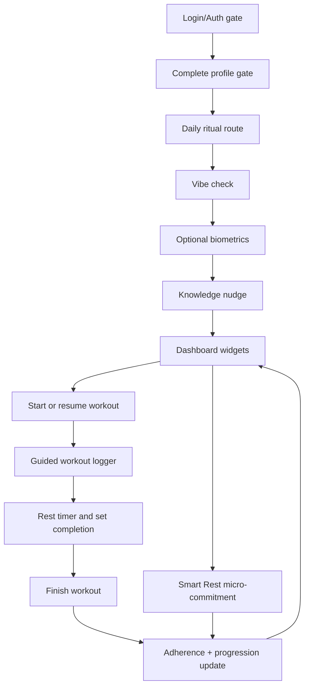
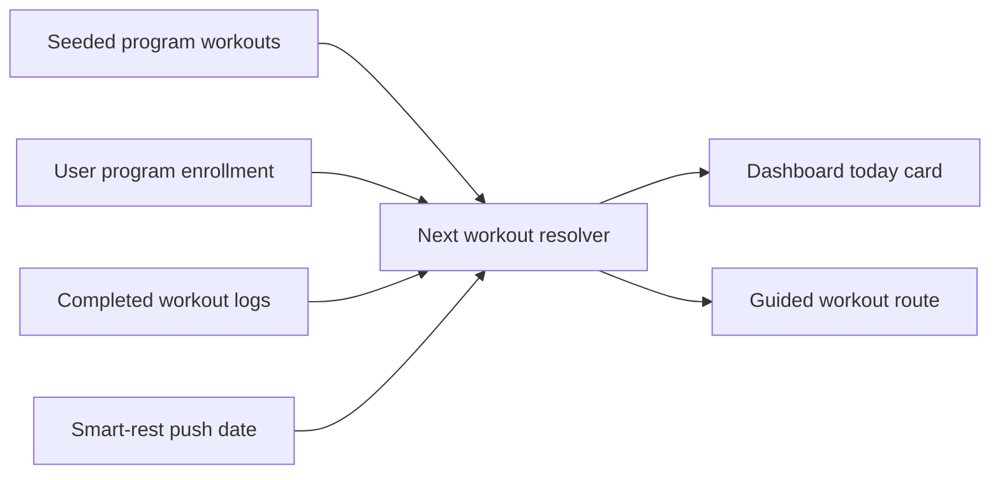

# feat: Build roadmap Phase 1 and Phase 2 MVP

## Summary

Build the Phase 1 + Phase 2 test MVP from the roadmap: a daily login ritual of vibe check, optional biometrics, and a static knowledge nudge; a dashboard with adherence, next workout, and biometric trends; guided workout execution with low-friction set logging and rest timer; smart-rest crediting; flexible next-workout handling; and minimum linear progression automation. This plan intentionally includes progression automation because the user resolved the strategy conflict in favor of including it for this LFG run.

---

## Problem Frame

Nexus is testing whether readiness-adjusted consistency can keep a committed lifter adherent for four consecutive weeks. The app must not be another logger: it needs to serve today's training, adapt when readiness is low, make whole-system signals visible, and teach a useful knowledge nudge without relying on LLMs or health integrations (see origin: docs/brainstorms/2026-06-02-nexus-roadmap-requirements.md).

The current app has auth, profile completion, a placeholder dashboard, seeded program/exercise/nudge catalogs, and RLS-protected user log tables. It does not yet have program enrollment, a schedule pointer, an adherence ledger, offline mutation queueing, daily ritual gates, workout routes, dashboard widgets, or progression state.

---

## Requirements Trace

- MVP-1: Serve an opinionated "today's session" from the seeded catalog and reduce decision fatigue.
- MVP-2: Provide guided, offline-capable workout execution with set/rep logging and rest timer.
- MVP-3: Require a once-per-local-day 1-10 vibe check before dashboard access.
- MVP-4: Let the user skip or partially complete daily biometrics without blocking the ritual.
- MVP-5: Show readiness-adjusted adherence feedback that credits smart rest rather than raw frequency.
- MVP-6: Require a Smart Rest micro-commitment before awarding rest-day adherence credit.
- MVP-7: Unlock one curated static knowledge nudge after the vibe check.
- MVP-8: Display biometric trends and interpretation from recent manual logs.
- MVP-9: Support flexible scheduling through "push workout" / smart-rest behavior instead of a full calendar system.
- MVP-10: Apply a minimum linear progression rule so repeated workouts feel alive during the four-week test.

---

## Assumptions

- "Today" means the browser's local date.
- The default source program is the first seeded beginner strength program, preferring `Starting Strength` when present.
- Readiness 1-3 suggests Smart Rest, 4-5 suggests a lighter session, and 6-10 proceeds normally.
- Smart Rest credit requires one explicit micro-commitment: push workout to tomorrow, prioritize sleep, hydrate, or complete light mobility.
- A workout counts as trained when the user explicitly finishes it; the UI warns when prescribed sets are incomplete.
- Biometric values are trend inputs only. They do not calculate readiness or adherence in this phase.
- Linear progression is intentionally in scope for this LFG run despite prior near-term deferral language in `STRATEGY.md`.

---

## Key Technical Decisions

1. **Add a small schema layer for enrollment, adherence, progression, and offline sync metadata.** Existing tables cover catalogs and raw logs but cannot deterministically answer "next workout," "why did today's adherence count," or "what target weight should be suggested next."
2. **Use FSD slices for domain surfaces.** Entities own Supabase models and pure calculations; features own user actions; widgets compose dashboard/ritual blocks; pages remain route shells.
3. **Gate dashboard through a daily ritual page, not a modal.** A route-level ritual is easier to resume after login, refresh, and offline reload, and it preserves the morning ritual as a first-class flow.
4. **Keep offline support MVP-scoped and explicit.** Use persisted React Query for catalog/read state and a Zustand/localStorage mutation queue for daily biometrics, nudge history, workout logs, set logs, adherence events, and progression updates. Show pending-sync states rather than pretending writes are immediately durable.
5. **Implement minimum progression as deterministic client/domain logic backed by stored progression state.** Increase a completed exercise's next target weight only when all prescribed main sets meet target reps; otherwise repeat the same load.

---

## High-Level Technical Design

---

## Implementation Units

### U1. Align strategy scope and Schema/RLS foundation

**Goal:** Make the user-confirmed Phase 2 scope durable and add the missing persistent data needed for next workout, adherence, progression, and offline idempotency.

**Requirements:** MVP-1, MVP-5, MVP-6, MVP-9, MVP-10.

**Dependencies:** None.

**Files:** `STRATEGY.md`, `supabase/migrations/*`, `src/shared/api/database.types.ts`, `supabase/seed.sql`, `docs/plans/2026-06-13-001-feat-roadmap-phase-1-2-plan.md`.

**Approach:** Update strategy wording so minimum linear progression is no longer near-term deferred for this MVP run. Add user-owned tables for program enrollment, daily adherence events, exercise progression targets, and offline mutation records if needed for idempotent sync. Add workout log columns for status/completion intent only if the existing `ended_at` model is insufficient. Preserve authenticated catalog reads and own-row policies; revoke `anon` on any new public tables.

**Patterns to follow:** Existing RLS style in `supabase/migrations/20260612035431_001_init_nexus.sql`; typed Supabase usage in `src/shared/api/database.types.ts`.

**Test scenarios:**
- New tables reject anonymous access and only expose own-row data to authenticated users.
- Enrollment can point to the default program and store a current workout pointer or start date.
- Adherence records can represent trained, programmed rest, smart rest, missed, and pending with a micro-commitment note for smart rest.
- Progression rows can store per-user/per-exercise target loads and update independently of catalog templates.

**Verification:** Schema lint passes; generated types expose the new rows; seed data still loads.

### U2. Add daily ritual and whole-system entities

**Goal:** Provide typed query/mutation APIs and pure domain helpers for today's biometric row, ritual completion state, knowledge nudge selection, and adherence scoring.

**Requirements:** MVP-3, MVP-4, MVP-5, MVP-6, MVP-7, MVP-8.

**Dependencies:** U1.

**Files:** `src/entities/daily-biometrics/*`, `src/entities/knowledge-nudge/*`, `src/entities/adherence/*`, `src/shared/lib/date.ts`, relevant `*.test.ts`.

**Approach:** Define interfaces first, then implement Supabase query functions, React Query hooks, local-date helpers, validation ranges, nudge selection, trend summarization, and readiness/adherence pure functions. Upsert today's biometrics by `user_id + log_date` and keep skipped fields null.

**Patterns to follow:** `src/entities/program/api/program-queries.ts`, `src/entities/user/api/app-user-queries.ts`, `src/shared/lib/weight.ts`.

**Test scenarios:**
- Local date helper returns stable `YYYY-MM-DD` values for browser dates.
- Vibe score accepts 1-10 and rejects missing/out-of-range values.
- Optional biometrics preserve nulls when skipped and reject negative values.
- Nudge selection prefers unseen nudges and handles exhaustion.
- Smart rest counts only when an allowed micro-commitment is present.
- Seven-day trends return "not enough data" for sparse metrics and directional summaries for two or more points.

**Verification:** Unit tests cover calculations and query mappers; query keys are persistable.

### U3. Add workout, schedule, and progression entities

**Goal:** Resolve today's workout, manage active workout logs and set logs, compute completion state, drive rest timers, and update minimum progression targets.

**Requirements:** MVP-1, MVP-2, MVP-9, MVP-10.

**Dependencies:** U1.

**Files:** `src/entities/workout-session/*`, `src/entities/progression/*`, `src/entities/program/*`, relevant `*.test.ts`.

**Approach:** Create a default enrollment resolver, infer next workout from enrollment/progress/completed logs, treat `ended_at = null` as active, prevent duplicate active sessions, and expose mutation APIs for starting, resuming, logging sets, finishing, and discarding when supported. Use `rest_seconds` from `workout_exercises`. Apply progression after finish: if all main prescribed sets meet target reps, increment target load by a conservative default; otherwise repeat.

**Patterns to follow:** Program sorting and loggable-block helpers in `src/entities/program/model/block-utils.ts`.

**Test scenarios:**
- Default program resolver chooses `Starting Strength` when seeded.
- Next workout advances after a finished log and respects smart-rest push behavior.
- Active workout detection resumes an unfinished log instead of creating another.
- Duplicate set numbers per exercise are blocked client-side.
- Null rest seconds do not start an automatic timer.
- Progression increments only after completing all target main sets and repeats otherwise.

**Verification:** Unit tests cover resolver, completion, active-session, timer input, and progression rules.

### U4. Implement offline mutation queue and query persistence expansion

**Goal:** Make daily ritual and gym-floor logging resilient when the network is unavailable.

**Requirements:** MVP-2, MVP-3, MVP-4, MVP-6.

**Dependencies:** U2, U3.

**Files:** `src/shared/lib/offline-queue/*`, `src/app/query-persist.ts`, `src/app/AppProviders.tsx`, `src/features/sync-offline-mutations/*`, relevant `*.test.ts`.

**Approach:** Persist catalog, daily ritual, nudge, and active workout query roots. Add a typed local queue with idempotency keys and sync status for user-owned writes. Flush on reconnect and after app hydration; show pending or failed states to calling features. Latest local daily edit wins for today's biometrics; set-log entries use stable client IDs to avoid duplicate replay.

**Patterns to follow:** Existing React Query persistence in `src/app/query-persist.ts`; Zustand user store in `src/entities/user/model/store.ts`.

**Test scenarios:**
- Queue survives reload and preserves write order.
- Successful flush removes queued mutations.
- Failed flush keeps mutations visible with an error state.
- Duplicate idempotency keys do not enqueue duplicate set logs.
- Persisted query filter includes only safe app data roots and clears on sign-out.

**Verification:** Unit tests cover queue behavior; manual offline mode can complete vibe and log a set with pending sync indicators.

### U5. Build the daily ritual route and features

**Goal:** Route authenticated, profile-complete users through vibe check, optional biometrics, and today's nudge before dashboard.

**Requirements:** MVP-3, MVP-4, MVP-7.

**Dependencies:** U2, U4.

**Files:** `src/app/App.tsx`, `src/pages/daily-ritual-page/*`, `src/features/log-readiness/*`, `src/features/log-daily-biometrics/*`, `src/widgets/todays-knowledge-nudge/*`, `src/pages/index.ts`, relevant tests.

**Approach:** Add a daily ritual page with step state derived from today's row and nudge history. Use shared UI primitives, accessible labels, semantic tokens, and complete loading/error/success states. Redirect to dashboard only when readiness and nudge exposure are complete for the local date.

**Patterns to follow:** Auth/profile route guards in `src/app/App.tsx`; form patterns in `src/pages/complete-profile-page/CompleteProfilePage.tsx`.

**Test scenarios:**
- Login/profile-complete user reaches ritual before dashboard when today's readiness is missing.
- Existing readiness skips directly to optional biometrics or nudge.
- Skipping biometrics unlocks the nudge with null optional fields.
- Nudge route redirects back to vibe check when readiness is absent.
- Offline save shows pending state and lets the ritual proceed locally.

**Verification:** Component tests cover gating and validation; e2e covers login-to-ritual-to-dashboard happy path with mocked Supabase where feasible.

### U6. Build dashboard widgets for adherence, next workout, biometrics, and nudge context

**Goal:** Replace the placeholder dashboard with an appealing mobile dashboard that makes the next action obvious.

**Requirements:** MVP-1, MVP-5, MVP-8, MVP-9.

**Dependencies:** U2, U3, U4, U5.

**Files:** `src/pages/dashboard-page/DashboardPage.tsx`, `src/widgets/adherence-summary/*`, `src/widgets/next-workout-card/*`, `src/widgets/biometric-trends-card/*`, `src/widgets/readiness-status-card/*`, relevant tests.

**Approach:** Compose widgets from entity data and feature actions. Prioritize Start Workout, show adherence toward the 80% four-week target, display smart-rest/rebound context, and render trend cards with sparse-data empty states. Offer Smart Rest micro-commitment when readiness is low.

**Patterns to follow:** Shared cards/buttons from `src/shared/ui`; FSD widget layer from rules/README.

**Test scenarios:**
- Dashboard shows loading, empty, error, and success states.
- Next workout card uses the resolver and prominently starts or resumes a workout.
- Low readiness exposes Smart Rest micro-commitment and credits adherence only after selection.
- Trend card hides missing metrics and explains insufficient data.
- Adherence widget does not present raw streak as the primary metric.

**Verification:** Component tests and e2e dashboard route check pass; mobile layout remains within the app shell.

### U7. Build guided workout execution and rest timer

**Goal:** Let the user start/resume today's workout, log sets quickly, run a rest timer, finish the workout, and return to an updated dashboard.

**Requirements:** MVP-2, MVP-9, MVP-10.

**Dependencies:** U3, U4, U6.

**Files:** `src/app/App.tsx`, `src/pages/workout-guided-page/*`, `src/features/start-workout/*`, `src/features/log-workout-set/*`, `src/features/finish-workout/*`, `src/widgets/workout-player/*`, relevant tests.

**Approach:** Add `/workout/:workoutId` or active workout route, create/resume a workout log, render ordered exercises, prefill previous/progression target weights, support one-tap prescribed set completion plus editable fields, start a rest timer after logged sets, and finish with completion warning when incomplete. On finish, write adherence and progression updates.

**Patterns to follow:** Program exercise ordering in `src/entities/program/api/program-queries.ts`; shared form/button primitives.

**Test scenarios:**
- Start creates a log when none is active and resume uses active log when one exists.
- One-tap set completion writes reps/weight from the prescription/progression target.
- Editing set values updates the displayed completion state.
- Rest timer starts from exercise rest seconds and can be skipped.
- Finish with incomplete sets warns but allows explicit completion.
- Offline set logging persists locally and syncs without duplicates.

**Verification:** Unit and component tests cover session behavior; e2e covers start-log-finish happy path.

### U8. Ship verification coverage and documentation updates

**Goal:** Ensure the MVP surfaces are tested, linted, built, and documented enough for review.

**Requirements:** All MVP items.

**Dependencies:** U1-U7.

**Files:** `cypress/e2e/*`, `src/**/*.test.ts`, `README.md` or targeted docs if setup changes.

**Approach:** Add focused unit coverage for pure logic and queue behavior, component coverage for forms/widgets, and Cypress coverage for the critical daily ritual/dashboard/workout route. Update docs only for developer-facing setup or domain behavior that reviewers need to understand.

**Patterns to follow:** Existing Vitest setup in `src/test/setup.ts`; Cypress auth stubbing pattern in `cypress/e2e/auth.cy.ts`.

**Test scenarios:**
- Daily ritual happy path reaches dashboard.
- Dashboard start-workout path reaches guided logger.
- Workout finish updates dashboard state.
- Offline pending states are visible for core journaling flows.

**Verification:** `npm run lint`, `npm run lint:ctx`, `npm run build`, `npm run test:unit`, `npm run test:e2e:ci`, and `npm run db:lint` pass where applicable.

---

## Scope Boundaries

### Included

- Manual 1-10 readiness.
- Optional manual biometrics and seven-day trends.
- Static curated knowledge nudges from seeded data.
- Readiness-adjusted adherence and Smart Rest micro-commitments.
- Next workout from seeded program/enrollment state.
- Guided workout logging, rest timer, and minimum linear progression.
- Offline-capable local persistence and sync status for core journal writes.

### Deferred to Follow-Up Work

- Full calendar scheduling.
- Exercise substitution.
- Rich deload programming beyond low-readiness guidance.
- Advanced analytics, charts, and gamification visualization.

### Outside this Product's Identity

- AI-generated custom programming.
- Social profiles and communities.
- Real-time communication and activity feeds.
- Smart Gym equipment-profile auto-adjustment.

---

## Risks and Mitigations

- **Offline mutation complexity:** Keep the queue typed and narrow to MVP write shapes; do not build a generic sync engine beyond current needs.
- **Schema overreach:** Add only state required to answer next workout, adherence, progression, and idempotent replay; preserve existing catalog tables.
- **Workout UX friction:** Prefer one-tap prescribed set completion and editable fields over keyboard-heavy forms.
- **Adherence semantics drift:** Keep smart rest credited only with micro-commitment and keep raw streaks secondary.
- **Progression scope creep:** Implement the smallest deterministic rule and defer advanced progression schemes.

---

## Sources and Research

- Origin requirements: `docs/brainstorms/2026-06-02-nexus-roadmap-requirements.md`.
- Product strategy: `STRATEGY.md`.
- Architecture rules: `.cursor/rules/01-tech-stack.mdc`, `.cursor/rules/02-fsd.mdc`, `.cursor/rules/03-agent-boundaries.mdc`, `.cursor/rules/04-frontend-implementation.mdc`, `.cursor/rules/05-lfg-guardrails.mdc`.
- Existing app surfaces: `src/app/App.tsx`, `src/pages/dashboard-page/DashboardPage.tsx`, `src/entities/program/api/program-queries.ts`, `src/app/query-persist.ts`.
- Existing schema: `supabase/migrations/20260612035431_001_init_nexus.sql`, `src/shared/api/database.types.ts`, `supabase/seed.sql`.
