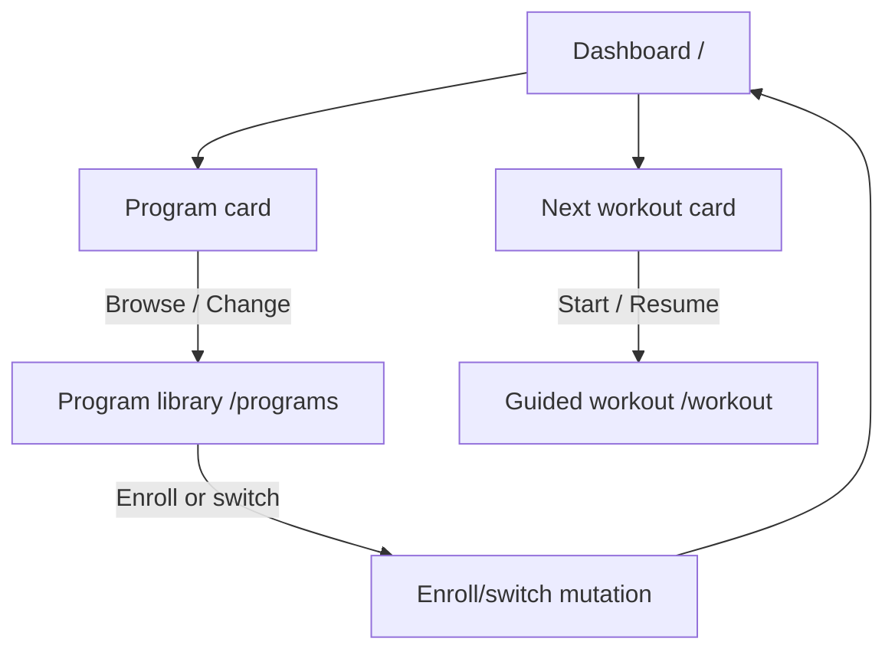
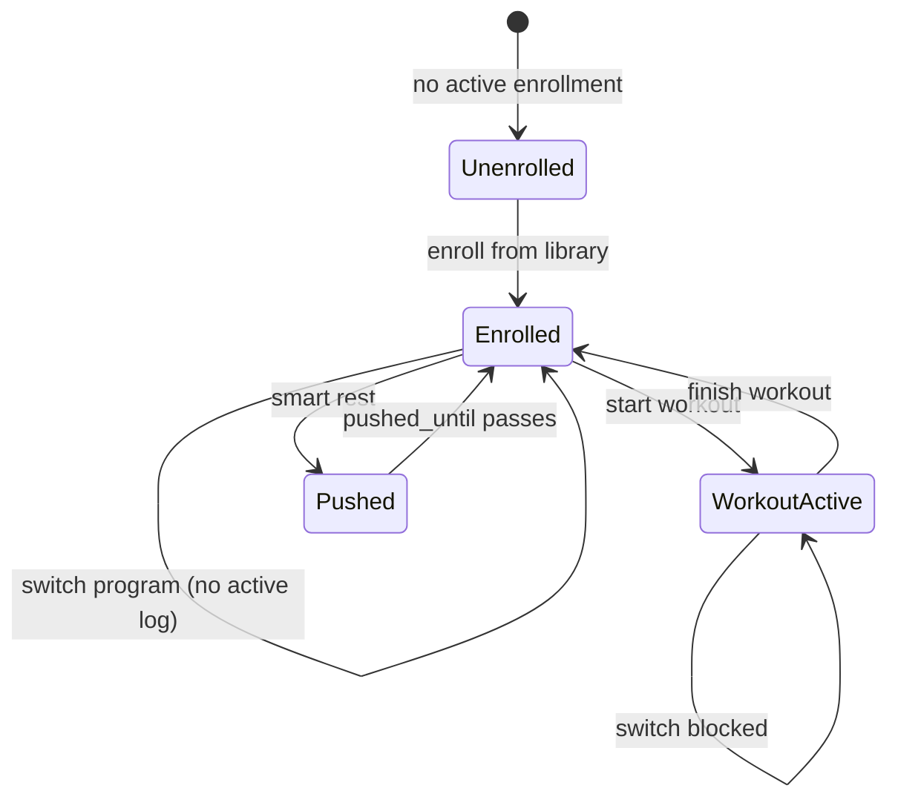

# feat: Connect program library to dashboard

## Summary

Add a dashboard card that surfaces the user's active program and links to a new program library page where they can browse seeded training templates and enroll or switch programs. Fix the dashboard start-workout path so it respects the enrolled program instead of silently defaulting to Starting Strength.

---

## Problem Frame

MVP-1 requires serving "today's session" from a preset program with minimal decision fatigue, but the app currently hides program choice behind a single "Begin Starting Strength" fallback. The catalog API and two seeded programs exist, yet there is no browsable library, no route to reach it, and no way to switch after the first enrollment. Users cannot discover or select "3 Day Push PPL," and `handleStartWorkout` auto-enrolls the heuristic default even when the user intended a different program.

The dashboard is the post-ritual home surface. A program card there is the natural entry point to the library and makes the active plan visible at a glance — supporting both MVP-1 (preset program → today's session) and daily-open rate by answering "what plan am I on?" without inferring it from the next-workout title.

---

## Requirements Trace

| ID | Requirement | Source |
|----|-------------|--------|
| R1 | User can reach a program library from the dashboard | User request |
| R2 | User can browse published programs from the seeded catalog | MVP-1 (see origin: docs/brainstorms/2026-06-02-nexus-roadmap-requirements.md) |
| R3 | User can enroll in a chosen program (first time) | MVP-1 |
| R4 | User can switch to a different program when not mid-workout | MVP-1 / flexible scheduling spirit |
| R5 | Dashboard reflects enrolled program and links back to library | User request |
| R6 | Start workout uses the enrolled program, not the default heuristic | Regression guard from flow analysis |
| R7 | Offline catalog reads continue to work via persisted React Query | Offline resilience constraint |

---

## Assumptions

- "Program library" means a dedicated browse-and-enroll page, not only a navigation stub.
- Program switching deactivates the current enrollment (`active = false`) and creates a new enrollment at week 1, day 1. Progression rows are not reset in this scope.
- Switching programs is blocked while an active workout log exists; the user must finish or discard the session first.
- Smart-rest `pushed_until` is cleared on program switch.
- Offline enrollment remains online-only for this slice (disable CTA with copy when offline); catalog browsing uses persisted cache.
- Library page sits behind the same auth and complete-profile gates as the dashboard; daily ritual gate applies when navigating to `/` but the library route does not re-run the ritual redirect.
- No new schema migration is required — `user_program_enrollments.active` and update RLS already support deactivate-and-insert switching.

---

## Key Technical Decisions

1. **Add `/programs` as a first-class page route** under `RequireCompleteUserProfile`, matching existing page-slice conventions (`src/pages/programs-page/`). Keeps routing discoverable and testable without introducing the unused widgets layer yet.
2. **Extend `workout-session` entity with enroll-or-switch mutation** rather than a new entity slice. Enrollment is already owned there; switching is a deactivate-then-insert sequence with query invalidation, not a schema change.
3. **Dashboard program card is informational + navigational** — shows enrolled program metadata (name, level, week/day) or an empty-state CTA. Primary enroll action lives on the library page to avoid duplicate enrollment entry points.
4. **Simplify the Next workout empty state** — replace "Begin {defaultProgram}" with copy pointing users to the program library card when unenrolled. Removes the silent default-enroll shortcut that conflicts with explicit program choice.
5. **Reuse existing catalog queries** — `usePublishedProgramsQuery` for the list; `useProgramWithWorkoutsQuery` only when expanding a program preview (lazy per card or detail panel).

---

## High-Level Technical Design

---

## Scope Boundaries

**In scope**

- Dashboard program card with enrolled summary or empty state
- Program library page listing seeded programs
- Enroll and switch flows with active-workout guard
- Route registration and page exports
- Fix start-workout enrollment to use active enrollment's `program_id`
- Unit tests for switch logic; E2E navigation smoke test

**Deferred to follow-up work**

- Offline mutation queue for enrollment writes
- Workout preview expansion / `/programs/:id` deep links
- Extracting dashboard cards into `src/widgets/`
- Progression reset on program switch
- Confirmation dialog for mid-block switch (use simple toast success for MVP)

**Outside scope**

- AI-generated custom programming
- Exercise substitution or relational exercise library
- New seeded programs beyond existing catalog

---

## Implementation Units

### U1. Enroll and switch program domain logic

**Goal:** Provide a single mutation that enrolls a user for the first time or switches programs by deactivating the prior enrollment.

**Requirements:** R3, R4, R6

**Dependencies:** None

**Files:**

- `src/entities/workout-session/api/workout-session-queries.ts` (modify)
- `src/entities/workout-session/api/use-workout-session.ts` (modify)
- `src/entities/workout-session/model/session.ts` (modify — optional pure helper for switch guard)
- `src/entities/workout-session/index.ts` (modify)
- `src/entities/workout-session/api/workout-session-queries.test.ts` (create)

**Approach:** Add `enrollOrSwitchProgram(client, userId, programId)` that (a) returns existing enrollment unchanged when `program_id` matches; (b) otherwise sets `active = false` on the current enrollment if present, then inserts a new row with defaults. Add `canSwitchProgram(activeLog)` pure helper. Expose `useEnrollOrSwitchProgramMutation(userId)` with cache invalidation on `workoutSessionQueryKeys.enrollment(userId)` and program-with-workouts keys.

**Patterns to follow:** `createDefaultEnrollment`, `updateEnrollmentPosition` in `src/entities/workout-session/api/workout-session-queries.ts`

**Test scenarios:**

- Happy path: no prior enrollment → insert active enrollment at week 1 day 1
- Happy path: enrolled in program A → switch to program B → A inactive, B active
- Edge case: enroll in same program again → idempotent, returns existing row, no duplicate insert
- Error path: switch while active workout log exists → mutation rejects before DB writes
- Integration: after switch, `getActiveEnrollment` returns new `program_id`

**Verification:** Vitest passes; mutation invalidates enrollment query so dashboard reflects new program.

---

### U2. Program library page

**Goal:** Browse published programs and enroll or switch from a dedicated route.

**Requirements:** R2, R3, R4, R7

**Dependencies:** U1

**Files:**

- `src/pages/programs-page/ProgramsPage.tsx` (create)
- `src/pages/programs-page/index.ts` (create)
- `src/pages/index.ts` (modify)
- `src/app/App.tsx` (modify)

**Approach:** Register `/programs` inside `RequireCompleteUserProfile`. Page loads `usePublishedProgramsQuery` and `useActiveEnrollmentQuery`. Render a vertical list of program cards showing name, description, level, specialty, days/week. Mark the active program with a badge. CTA per card: "Enroll" (unenrolled), "Current program" (disabled), or "Switch to this program" (different enrollment). On success, toast + `navigate('/')`. Show skeleton while loading; error state with retry. Block switch CTA when `useActiveWorkoutLogQuery` returns a log — show inline message linking to `/workout`.

**Patterns to follow:** Card layout and loading skeletons from `src/pages/dashboard-page/DashboardPage.tsx`; semantic tokens from `.cursor/rules/04-frontend-implementation.mdc`

**Test scenarios:**

- Happy path: two seeded programs render with metadata
- Happy path: tap Enroll on PPL → navigates to dashboard with new enrollment
- Edge case: catalog loading → skeleton visible
- Edge case: catalog fetch error → destructive alert or retry affordance
- Edge case: active workout exists → switch buttons disabled, resume copy shown
- Error path: mutation failure → toast error, remain on library page

**Verification:** Route reachable after auth; enrolling updates dashboard state without hard refresh.

---

### U3. Dashboard program card

**Goal:** Add a card on the dashboard that shows program status and links to the library.

**Requirements:** R1, R5

**Dependencies:** U2 (route target)

**Files:**

- `src/pages/dashboard-page/DashboardPage.tsx` (modify)

**Approach:** Insert a new `Card` between Readiness and Next workout (or immediately after Next workout — either is acceptable; prefer before Next workout so program context precedes session action). Use `BookOpen` or `Library` icon. Enrolled state: program name, level, `Week X · Day Y`, outline button "Change program" → `navigate('/programs')`. Unenrolled state: muted copy "No program selected" + primary/outline "Browse programs". When enrolled, resolve program metadata from `useProgramWithWorkoutsQuery` or join against `programsQuery.data` by `program_id` (prefer lightweight list lookup when possible).

**Patterns to follow:** Existing dashboard card structure with `CardHeader` + `CardTitle` + icon + `CardContent`

**Test scenarios:**

- Happy path: enrolled user sees program name and position
- Happy path: unenrolled user sees empty state CTA
- Happy path: tap CTA navigates to `/programs`
- Edge case: enrollment exists but catalog still loading → skeleton or name from enrollment only

**Verification:** Card visible on dashboard after daily ritual; navigation works on mobile-width layout.

---

### U4. Align workout start with enrolled program

**Goal:** Remove silent default-program enrollment from the start-workout path and simplify the unenrolled Next workout card.

**Requirements:** R6, R3

**Dependencies:** U1, U3

**Files:**

- `src/pages/dashboard-page/DashboardPage.tsx` (modify)
- `src/pages/workout-guided-page/WorkoutGuidedPage.tsx` (modify — align fallback copy if needed)

**Approach:** In `handleStartWorkout`, require `enrollmentQuery.data` before starting; remove branch that calls `createEnrollment.mutateAsync(defaultProgram.id)`. If unenrolled, Next workout card shows copy directing user to the program card / library instead of "Begin Starting Strength." Ensure `programId` for `useProgramWithWorkoutsQuery` comes from enrollment when present (already mostly true; verify no fallback masks wrong program after switch).

**Patterns to follow:** `resolveTodayWorkoutState` in `src/entities/workout-session/model/session.ts`

**Test scenarios:**

- Happy path: enrolled user starts workout for enrolled program's next session
- Regression: user who selected PPL via library does not get SS workout on start
- Edge case: unenrolled user sees no start button; only library-directed copy
- Edge case: resume active log still works when enrolled

**Verification:** Manual flow E2 from flow analysis passes; no `defaultProgram.id` in start-workout enrollment path.

---

### U5. Tests and E2E navigation

**Goal:** Lock enroll/switch behavior and dashboard → library navigation.

**Requirements:** R1, R7

**Dependencies:** U1–U4

**Files:**

- `src/entities/workout-session/api/workout-session-queries.test.ts`
- `cypress/e2e/programs.cy.ts` (create)

**Approach:** Vitest for `enrollOrSwitchProgram` with mocked Supabase client (mirror `src/entities/program/api/program-queries.test.ts`). Cypress stub auth + Supabase: visit dashboard after ritual gate stub, click program card CTA, assert `/programs` URL and program list heading. Keep E2E narrow — full enroll flow can stub mutation success.

**Test scenarios:**

- Unit: all U1 scenarios
- E2E: authenticated user navigates dashboard program card → library page
- E2E: library page shows at least one program name from stubbed catalog

**Verification:** `npm run test:unit` and `npm run test:e2e:ci` pass.

---

## System-Wide Impact

- **End users:** Can see and change their training plan; dashboard becomes the hub for program context.
- **Developers:** Enrollment logic centralized in one mutation; dashboard no longer duplicates enroll CTAs.
- **Offline:** Catalog reads unchanged (persisted); enrollment writes require network (documented limitation).

---

## Risks and Dependencies

| Risk | Mitigation |
|------|------------|
| Deactivate-then-insert race leaves user with no active enrollment | Perform deactivate only when insert will succeed; surface error toast and refetch on failure |
| Switch during active workout orphans log | Block switch in UI and mutation when active log exists |
| Progression weights bleed across programs | Document in Assumptions; defer reset to follow-up |
| Two enroll CTAs confuse users | Remove Next workout "Begin default" button; library owns enroll |

**Prerequisites:** Phase 1+2 MVP state migration (`user_program_enrollments`) already shipped.

---

## Open Questions

| Question | Disposition |
|----------|-------------|
| Confirm switch resets week/day to 1 | Assumed yes for this plan |
| Offline enroll queue | Deferred to follow-up |
| Program detail depth (list vs expandable preview) | List with description metadata only for MVP |

---

## Sources and Research

- `src/pages/dashboard-page/DashboardPage.tsx` — current card patterns and enrollment gap
- `src/entities/program/api/program-queries.ts` — catalog API
- `src/entities/workout-session/api/workout-session-queries.ts` — enrollment API
- `supabase/seed.sql` — two seeded programs
- `docs/plans/2026-06-13-001-feat-roadmap-phase-1-2-plan.md` — MVP-1 context
- `docs/brainstorms/2026-06-02-nexus-roadmap-requirements.md` — product framing
- `STRATEGY.md` — program choice fits guided execution track; AI programming out of scope
